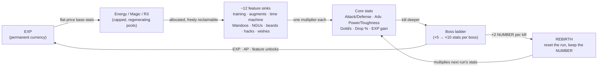

# NGU Idle — Systems & Math Design Reference

*Reverse-engineered from the game's decompiled C# source (the `decompiled/` folder next to this file) for design study. All formulas and constants below come from the actual game code, rewritten in math notation. Intended use: borrowing systems, logic, numbers, progression, rebirth, EXP, and character-improvement ideas for a new 3D game — not reproducing NGU Idle itself.*

---

## The Big Picture

Before the details, here is the architecture that makes NGU Idle work. Almost every design decision in the game serves one of these five ideas:

1. **A tiny stat core, fed by dozens of spokes.** The game has only a handful of stats that matter — Attack/Defense, Adventure Power/Toughness/HP/Regen, Gold/sec, Drop Chance, EXP gain. Every feature in the game (there are ~20) exists to emit **exactly one multiplier** into that core. Within a category bonuses add; across categories they multiply. This is why the game can keep adding systems for years without rebalancing anything: a new feature is just one more factor in a product.

2. **Resources are allocated, not spent.** Energy and Magic regenerate into a capped pool and are *assigned* to features, reclaimable at any time with zero loss. The moment-to-moment game is portfolio rebalancing ("where do my bars go this hour?"), not scarcity management. Strategic cost is opportunity, never loss.

3. **One permanent currency (EXP) under an exponential umbrella.** EXP survives every reset, comes mostly from one-time events (boss firsts, challenge clears, set completions), and buys base stats at **flat, never-inflating prices**. The exponential growth curve lives entirely in the multiplier chain above the base stats — so pricing stays legible forever ("3 EXP = 1 Power, always") while power still explodes.

4. **Prestige is a live product the player watches grow.** The rebirth "NUMBER" is recomputed every frame from boss kills (×2 each), run duration, training volume, blood magic, and half a dozen permanent systems. A brutal piecewise time-penalty curve makes sub-hour resets mathematically worthless — session cadence is enforced by math, not lockout timers.

5. **Every sink has a different time signature.** √t systems (NGUs, augments), log-t systems (hacks), fixed-clock systems (wishes: 4 h/level minimum), income-equilibrium systems (gold diggers), full-pool-only systems (beards), daily puzzles (cooking), multi-day timers (cards). Something is *always* about to pop, even when any one system is walled.



The boss ladder deserves special mention as the game's master clock: boss stats grow **×5 per boss** (bosses 5–20) then **×10 per boss** (21–300). No single system can climb that — only the *product* of all of them can, which is what forces the player to engage with everything. Feature unlocks, zone gates, and difficulty tiers all key off the boss number, so one integer indexes the entire game.

## Contents

1. **The Multiplier Chain, EXP, Number Formatting & Offline Progress** — the keystone architecture
2. **Core Resources: Energy, Magic, R3 & Training** — the pool/allocation engine and the first stat sink
3. **Rebirth, Number, and Challenges** — the prestige loop
4. **Five More Challenge Types** — restriction-run design in depth
5. **The Permanent EXP-Sink Economy** — QoL ladders and stat shops
6. **Mid-tier Systems: Augments, Time Machine, Wandoos, Blood Magic**
7. **Late Systems: NGUs, Beards, Hacks, Wishes, Gold Diggers** — a taxonomy of sink curves
8. **Combat, Adventure Zones, Bosses & ITOPOD**
9. **Loot, Equipment, Boosts & Daycare** — gear as an incremental track
10. **Economy & Side Systems** — Money Pit, Yggdrasil, Cards, Cooking, Quests, AP
11. **Achievements** — weighted-badge reward math
12. **The Waldo Hunt** — hiding content in the UI itself
13. **Distilled Playbook for a 3D Incremental** — the transferable patterns, collected

---

## The Multiplier Chain, EXP, Number Formatting & Offline Progress

### 1. What this system is

NGU Idle is an idle RPG where the player pours two regenerating resources (Energy and Magic, later a third, "R3") into a dozen semi-independent mini-systems (training, augments, time machine, NGU stats, beards, diggers, hacks, wishes...). Each mini-system exists to emit **exactly one multiplier** into a tiny set of core stats — Attack/Defense, Adventure Power/Toughness, Gold/s, Drop Chance, EXP gain. The meta-architecture is a hub-and-spoke multiplier chain centered on `Character`, which recomputes totals every 0.5 s from ~15 controller callbacks, while the fine-grained simulation runs at a fixed **50 ticks/second** (0.02 s `InvokeRepeating` on every bar-filling system). EXP is the permanent cross-rebirth currency that buys base resource stats, so every run compounds.

### 2. The math

**2.1 Tick model and resource generation.** Every resource is a triple (Power, Bars, Cap) plus a Speed. With speed $S = S_{base}(1+\text{equip\%})$ clamped to $[1, 50]$, the bar fills every $\lceil 50/S \rceil$ ticks, granting $B_{total}$ resource per fill:

$$\text{E/s} = \frac{50}{\lceil 50/S \rceil} \cdot B_{total}, \qquad S \le 50 \Rightarrow \text{max one fill per tick}$$

Each total is a pure product with additive stacking *only inside the equipment layer*:

$$P_{total} = P_{base}\cdot \pi_{perk}\cdot(1 + \textstyle\sum \text{equip specs})\cdot \mu_{macguffin}\cdot q_{quirk}\cdot w_{wish}\;[\times 2 \text{ per active potion}]$$

Same shape for Bars and Cap. Power/Bars hard-cap at $10^{18}$; Caps at $9{\times}10^{18}$ (long max). Speed of a mini-system is then typically $\text{progress/tick} \propto P_{total}\cdot(\text{invested resource})/\text{cost}$. Resource spent is **allocated, not consumed** — one keypress reclaims it all.

**2.2 The core multiplier chain.** Attack (Defense is identical):

$$A = \Big(100 + T_{atk}\cdot M\cdot \pi_{itopod}\cdot(1+\tfrac{equip}{100})\cdot r_{jerk}\Big)\cdot \frac{1}{D}\cdot \prod_{i} m_i$$

where $T_{atk}$ = summed training levels, $M$ = the rebirth "NUMBER" multiplier, $D$ = difficulty divider (1 / $10^{25}$ Evil / $10^{50}$ Sadistic), and $\prod m_i$ is **11 independent multiplicative sources**: augments × Wandoos × (1+Yggdrasil) × NGU × 2 permanent-Ygg terms × beards × diggers × quirks × hacks × wishes × cards × MacGuffin. Floor 100; `Infinity → double.MaxValue`. Max HP $= 10 + 10A$. Adventure stats use the same recipe but with **additive flat** equipment/cube layers first: $(base + equip_{flat} + cube)\times(1+\text{advTraining})\times \text{10 more multipliers}$, float-capped at $10^{36}$.

Composition rule throughout the game: *within a source category, bonuses add; across categories, they multiply.* The only exponent dampening: drop-chance uses $\text{lootFactor}^{1/3}$ for certain rare rolls, beard speed uses $\sqrt{P_{total}}$, and NGU/beard *bonus curves* apply their own softcaps internally.

**Gold:** $GPS = g_{TM} \cdot \max(\text{highestBoss}-27, 1)\cdot \text{fills/s}\cdot m_{speed}\cdot m_{gold}\cdot m_{blood}\cdot m_{beard}\cdot m_{NGU}\cdot m_{challenge} - drain_{diggers}$, floored at 0. Diggers (a permanent gold-multiplier system) charge a *percentage GPS upkeep* — a genuine income-vs-investment drain.

**2.3 EXP — the cross-rebirth currency.** Gain pipeline (applied to every award):

$$\Delta = \lfloor exp_{base}\cdot m_{NGU}\cdot(1+equip_{EXP})\cdot 1.05_{perk}\cdot m_{digger}\cdot m_{hack}\cdot m_{wish}\cdot m_{cooking}\rfloor,\quad realExp \le 2^{63}{-}1$$

Sources: story-boss kills — for boss $n \ge 23$: $exp = \max(\frac{n-13}{10},1)\cdot(1+0.02\,c_{24h})$ (+1 flat with any 24-hour-challenge completion) × ITOPOD perk; early bosses give scripted drips (2/3/4/10, then 1/kill); Titans give fixed EXP per kill (also offline); ITOPOD gives EXP every $k$ kills; the Money Pit gambles gold for +1…+25 EXP outcomes; each challenge completion pays a scripted EXP reward; AP shop converts AP→EXP at 200 AP per EXP (200/500/2000 EXP packs). Sinks (all permanent, all linear prices): +1 Energy bar = 80 EXP, +10 k Energy cap = 40, +0.1 Energy power = 15, speed +0.1 = 2→20→200 tiered; **Magic versions cost exactly 3×** (240/120/45); adventure Power/Toughness +1 = 3 EXP, Regen +1 = 50; permanent Yggdrasil fruits at fixed EXP prices. AP is a parallel currency (achievement-multiplied, ×1.2 set bonus) sunk into QoL, potions (×2 power) and cosmetic-adjacent upgrades.

**2.4 The rebirth NUMBER.** On rebirth: $bossMulti$ doubles per boss killed (×1.5 Evil), and

$$timeMulti(t) = \begin{cases} t/(2^{35}\cdot 3600) & t<60s\\ \dots \text{(11 brutal piecewise dividers)} \dots \\ 1 + t/172800 & t \ge 3600s\end{cases}$$

$$M_{next} = 1 + bossMulti\cdot oldBossMulti\cdot oldTimeMulti\cdot\Big(1+\lfloor \tfrac{T_{levels}}{10^4}\rfloor\Big)\cdot timeMulti\cdot \mu\cdot y_{perm}\cdot blood\cdot beard\cdot NGU\cdot hack$$

The $old\cdot$ terms mean each run's multiplier **feeds the next run multiplicatively** — geometric meta-growth. The sub-hour dividers (up to $2^{35}\cdot 3600$) make speed-rebirthing worthless below ~30–60 min: pacing enforced by math, not timers. Rebirth also seeds next run's Energy cap: $cap' = \lfloor energyGained/20\rfloor + 500$, capped at 100 k.

**2.5 Offline progress.** On load: elapsed $t$ = server time (`getTime.php`, anti-clock-cheat) minus saved epoch, ignored if $<10$ s, clamped to 1 year. Then *every* system is fast-forwarded in closed form over $N = 50t$ ticks:

- Constant-cost bars: $levels = \lfloor N / \lceil 1/p\rceil\rfloor$.
- Linear-scaling bars (tick cost $\propto L{+}1$): invert the arithmetic series — $n = \big\lfloor\frac{\sqrt{4c\,n_0^2 - 4c\,n_0 + c + 8N} - \sqrt c}{2\sqrt c}\big\rfloor$ with $c = 1/(p(L_0{+}1))$.
- Gold-limited systems compute both time-earned levels and gold-afforded levels (linear cost: total $= \frac{b}{2}(n^2{+}n{-}m^2{-}m)$; quadratic cost: total $= \frac{b}{6}(2n^3{+}3n^2{+}n - \dots)$, inverted via the cubic formula) and award the **min**, deducting exact gold.
- Titans: $kills = \lfloor(banked + t)/spawnTime\rfloor$, only if autokill stat gates are met.
- ITOPOD auto-picks the floor $\lfloor \log_{1.05}(A_{adv}/765)\rfloor$ (each floor is +5% enemy stats), kills every respawn interval.
- Certain challenges disable offline progress entirely (their whole point is active play).

**2.6 Numbers & formatting.** No bignum library: `double` for combat/gold (saturating at `double.MaxValue`), `long` for resources/EXP (saturating at $9.22{\times}10^{18}$), `float` for most multipliers (capped $10^{36}$). Display: below $10^6$ raw with commas; above, $n/1000^{\lfloor\log_{1000}n\rfloor}$ with a 102-entry Latin suffix table ("Million" … "CENTILLION" at $10^{306}$), or user-selectable engineering ($E{+}k$, $k\in 3\mathbb{Z}$) / scientific formats.

**2.7 Save-state scope.** A save = one serializable `PlayerData` (BinaryFormatter → string, MD5 checksum wrapper) holding ~45 sub-objects: every system's levels/progress bars/invested resources, all currencies, boss indices, challenge records, achievements, settings, playtime timers, the `lastTime` epoch — **and the saved RNG states** (loot, adventure, boost-combine, pit, daily-spin, cards) so reloading can't reroll drops. Loading runs a version-numbered migration ladder (`if version < 354 …`) patching old saves field-by-field. Newer-version saves are rejected outright.

### 3. Interconnections

Energy/Magic → mini-systems → one multiplier each → Attack/Defense & Adventure → bosses/Titans → EXP/AP/PP → permanent base stats → more Energy/Magic: a closed compounding loop. Several multipliers point back *into* the resource pipeline itself (NGU boosts energy speed of other NGUs; beards scale off $B\cdot\sqrt P$; Wandoos speed is boosted by advanced training which is bought with energy). Tension comes from: (a) one shared E/M pool allocated across ~8 competing systems (pure opportunity cost, since reclaiming is free); (b) digger GPS drain vs. time-machine income; (c) rebirth wiping run-scoped multipliers (augments, Wandoos, current NGU levels) while EXP purchases, challenge rewards, perks, quirks, beards-perm and MacGuffins persist.

### 4. Pacing & gating

Boss stats are the master clock: bosses 4–19 multiply stats ×5 each, bosses 20–300 ×10 each — a double-exponential wall that only the multiplicative chain can climb. Features unlock on boss number or gold (Pit at 100 k gold; Titans at effective boss 58/66/82/100/116…; difficulty tiers add +301 to effective boss ID). Evil/Sadistic difficulties divide player stats by $10^{25}/10^{50}$ and Wandoos by $10^{18}/10^{36}$, recycling all content twice. Early game: minutes-long rebirths gated by the timeMulti dividers; late game: 24 h+ rebirths where offline closed-forms carry most progression. Hard numeric caps ($10^{18}$, speed 50, NGU level caps) are explicit endgame ceilings.

### 5. Borrowable design lessons

1. **One system, one multiplier.** Let every new feature output a single named factor into a small stat core; content scales horizontally forever without rebalancing the core. In a 3D RPG: each district/dungeon/faction emits one buff into ATK/DEF/loot.
2. **Add within a source, multiply across sources.** Equipment slots sum; systems multiply. Players get legible gear math and explosive cross-system synergy — and the stats screen can show the whole chain as "base × a × b × c", which NGU literally renders as its best tooltip.
3. **Allocated, not consumed, resources.** Reclaimable Energy/Magic turns spending into a *routing puzzle* (where do my bars go this hour?) instead of a scarcity grind — perfect for an idle layer under a 3D action game.
4. **Punitive piecewise time curves instead of cooldowns.** The $t/(2^{35}\cdot3600)$ rebirth divider makes too-fast prestiges mathematically pointless without ever telling the player "no."
5. **Closed-form offline simulation with min(time, resources).** Invert your cost-series (quadratic/cubic) so a year offline resolves in O(1) per system, capped by both elapsed time and affordable currency — then show an itemized "while you were away" report; it is the retention screen.
6. **Saturate, don't overflow — and save your RNG.** Explicit caps at every type boundary ($10^{18}$/$10^{36}$/`double.MaxValue`) plus serialized RNG states and version-ladder migrations are the cheap infrastructure that lets a numbers game run for years without bignum or save-scumming exploits.

---

## Core Resources: Energy, Magic, R3 & Training

### 1. What the system is

NGU Idle's entire engine runs on three generated resources — **Energy**, **Magic**, and the late-game **Resource 3 (R3)** — that act as *allocatable workforces*, not consumables. Each resource fills a progress bar every game tick (the game runs at **50 ticks/sec**); each fill deposits units into an "idle" pool, and the player *assigns* idle units to features (Training, Augments, Wandoos, NGU, etc.). Assigned units keep working forever and can be reclaimed at any time with no loss. The player spends **EXP** (the permanent meta-currency earned from bosses and rebirths) to permanently upgrade each resource's four substats, and dumps the resulting Energy into Training bars that convert levels into raw Attack/Defense.

### 2. The math

**The four substats (identical structure for all three resources):**

| Substat | Mechanical meaning | Formula it appears in |
|---|---|---|
| **Speed** `S` | Bar-fill rate; bar gains `S/50` progress per tick. Hard-capped at **50** (= one fill per tick) | `ticksPerFill = ceil(50/S)` |
| **Bars** `B` | Units deposited per completed bar | `resource/sec = 50/ceil(50/S) · B` |
| **Cap** `C` | Max stored units (idle + assigned) | generation clamps at `C_total` |
| **Power** `P` | Global work-rate multiplier for features consuming that resource | e.g. Adv. Training uses `√P` |

Because fills are quantized to whole ticks, throughput is a step function of Speed: `resource/sec = (50/⌈50/S⌉)·B`. The tooltip even tells players the next breakpoint: `S_next = 50/⌊50/S⌋`. Speed is deliberately the cheapest and first-capped stat; after `S = 50` all growth must come from Bars (quantity) and Power (quality).

Each *total* substat is `base × Π(multiplier sources)` — ITOPOD perks, equipment specs (additive `1 + Σbonus%`), MacGuffins, Beast Quest, Wishes, potions — clamped by two global hard caps: `hardCap = 9×10^18` for Caps, `hardCapPowBar = 10^18` for Power and Bars, with a floor of 1. Base Energy Speed is also floored at 1 after item modifiers.

**EXP purchase pricing — flat unit prices, no cost growth.** All bulk sizes cost exactly proportional amounts; the three resources are priced on one ratio ladder:

| Purchase (per unit) | Energy | Magic (×3) | R3 (×100,000) |
|---|---|---|---|
| +1 Speed (until 50) | 20 EXP | 30 EXP | 3,000,000 EXP |
| +1 Bar | 80 EXP | 240 EXP | 8,000,000 EXP |
| +250 Cap | 1 EXP | 3 EXP | 100,000 EXP |
| +1 Power | 150 EXP | 450 EXP | 15,000,000 EXP |

Custom bulk-buy formulas confirm perfect linearity: `cost_power = 150n·k`, `cost_cap = (n/250)·k`, `cost_bar = 80n·k` with `k ∈ {1, 3, 100000}`. There is **no per-purchase inflation** — the price curve is flat, and scarcity comes entirely from EXP income, not cost escalation. Three one-time "special" starter offers (+0.2/+0.3/+0.4 Speed for 1/2/3 EXP) teach the purchase UI for pocket change.

**Starting state & unlock grants:** a fresh character has `C=500, B=1, P=1, S=1` Energy (250 stored). Unlocking Magic sets `C=10000, S=3, B=1`; unlocking R3 the same. Relative pricing makes Power ≈ 2× a Bar ≈ 150× 250-Cap — Cap is intentionally dirt-cheap because features gate on *amount allocated*, not rate.

**Early-cap bootstrap loop:** while base Energy Cap ≤ 100,000, rebirthing sets

`capEnergy ← min(100000, ⌊energyGained/20⌋ + 500)`

so every 20 Energy generated during a run converts to +1 permanent base cap (tracked up to 3M gained). Direct Cap purchases are locked until base cap reaches 100K — the first ~hours of cap growth come from *playing*, not buying.

**Basic Training (Attack/Defense).** Six attack and six defense skills. Energy assigned to skill *i* fills its bar at

`Δprogress/tick = E_assigned(i) / trainCap(i)` → level-up at 1.

Assigning exactly `trainCap(i)` yields the maximum **50 levels/sec**; more is wasted (auto-advance overflows the excess to the next skill). Constants:

| Skill i | trainCap (Normal) | trainCap (Evil, ×100) | trainFactor F(i) | Unlocks at |
|---|---|---|---|---|
| 0 | 2,500 | 250,000 | 150 | start |
| 1 | 15,000 | 1,500,000 | 1,000 | 5,000 lvls in skill 0 |
| 2 | 30,000 | 3,000,000 | 5,000 | 10,000 lvls in skill 1 |
| 3 | 50,000 | 5,000,000 | 20,000 | 15,000 lvls in skill 2 |
| 4 | 70,000 | 7,000,000 | 80,000 | 20,000 lvls in skill 3 |
| 5 | 100,000 | 10,000,000 | 250,000 | 25,000 lvls in skill 4 |

Stat conversion is superlinear in level and steeply tiered by skill:

`TotalAttack = Σ_i level_i^1.3 · F(i)`
`Attack = (100 + TotalAttack · attackMulti · itopodStat · (1 + equip%/100) · boost) / difficulty × augments × wandoos × (1+yggdrasil) × NGU × permYgg × beards × diggers × beastQuest × hacks × wishes × cards × macguffin`

(Defense identical; `maxHP = 10 + 10·Attack`.) Note the ~12-term pure multiplier chain — every other feature in the game plugs in here.

**Rebirth cap reduction (the training prestige loop).** On rebirth, levels reset but each skill's energy cap shrinks permanently:

`Δcap(i) = clamp( 1 + (level_i − 500i)^1.2 / 500 · (trainCap(i)/1000), 1, trainCap(i)/10 + 1 )`
`trainCap(i) ← max(1, trainCap(i) − Δcap(i))`

The reduction is proportional to the *current* cap and clamped at **10% + 1 per rebirth**, so caps decay roughly geometrically (≥ ~22 rebirths to bottom out) toward a floor of 1 Energy — eventually 1 unit of Energy caps training at 50 levels/sec, freeing the whole pool for other features. Level-up multipliers from an ITOPOD perk, a Beast quirk, and a Wish each add +1 level per level-up (up to 4×/tick).

**Advanced Training.** Unlocks when *both* attack skill 5 and defense skill 5 reach **25,000 levels**. Five tracks (Adv. Toughness, Adv. Power, Block, Wandoos Energy, Wandoos Magic) share the formula:

`Δprogress/tick = (E_assigned / 50) · √(P_energy) · speedBonus / (baseTime · (level + 1))`

with `baseTime = 1.2×10^7` for the three combat tracks and `2.4×10^7` for the Wandoos tracks (per the serialized cost table). Time per level grows linearly with level (total time to level L ∝ L²), and Energy Power enters under a **square root** — two stacked diminishing-returns shapes that keep this sink relevant for hundreds of hours. Payoffs: Adventure Power/Toughness bonus `= 0.1·L^0.4` (another softcap: power 0.4), Block damage reduction `= 100 − 50/(1 + f·L) %` (asymptotic), Wandoos speed `= f·L` (linear). Per-track level *targets* plus an auto-advance rotor automatically re-route energy to the next unfinished track; an ITOPOD perk banks a fraction of levels through rebirth.

### 3. Interconnections

EXP → resource substats → idle pools → allocated across ~8 competing features → Attack/Defense/feature multipliers → bosses → EXP. The tension is entirely in the **shared idle pool**: Training, Augments, Time Machine, Wandoos, NGU and Advanced Training all draw from the same Cap-limited Energy. Basic training ignores Power and Bars (only raw allocation vs. cap matters), while Advanced Training scales with `√Power` — so the same EXP purchase serves different features unequally, creating real build choices. The rebirth cap-reduction converts training from the dominant early sink into a near-free background process, silently re-budgeting the pool toward later features. A hotkey ("R") reclaims all Energy *except* training — the UI acknowledges allocation churn as the core verb.

### 4. Pacing & gating

Tick 0: 500 cap, 1 energy/sec, first upgrades for 1–3 EXP. **Boss 17** reveals Power and Cap purchase pods (with an explicit "reach boss 17" hint); Cap buying additionally needs the 100K base-cap bootstrap. **Boss 37** kill unlocks Magic (granted at cap 10K/speed 3). **R3** unlocks only by consuming a special item (id 294) found deep in Evil difficulty — its 100,000× price tag is calibrated to late-game EXP income. Training tiers unlock every `5000·(i+1)` levels; Advanced Training at 25K in the final tier; Evil difficulty multiplies training caps ×100, re-walling a solved system. Speed's hard cap at 50 is the first wall every player hits (~minutes), pivoting spending to Bars.

### 5. Borrowable design lessons

- **Resources as reassignable workers, not fuel.** Zero-loss reclaim makes experimentation free and turns "where do I put my energy?" into the moment-to-moment game — ideal for a 3D game where crew/mana/drones could be visibly stationed at machines.
- **Four orthogonal substats per resource (Cap/Speed/Bars/Power)** give one currency four distinct upgrade feels: ceiling, cadence, quantity, quality — and let you cap one (Speed=50) to steer spending.
- **Flat unit prices, walled by income.** Skipping exponential cost curves entirely and gating via EXP scarcity + unlock walls keeps bulk-buy math trivial and makes the ratio ladder (1× / 3× / 100,000×) the *entire* balance lever for new resource tiers.
- **Prestige that shrinks costs instead of growing output:** the 10%-per-rebirth training-cap decay (`Δ ∝ level^1.2`, clamped) rewards deep runs, compounds geometrically, and frees a shared budget rather than inflating numbers.
- **Quantized tick throughput with visible breakpoints** (`50/⌈50/S⌉`) turns a continuous stat into satisfying discrete jumps — great for readable feedback in 3D (animation speed steps).
- **Stack two softcaps on late systems** (`√Power` × time ∝ level+1, payoffs at `L^0.4`): each input keeps helping but never dominates, stretching one mechanic across the whole endgame without rebalancing.

---

## Rebirth, Number, and Challenges

### 1. What the system is

NGU Idle's prestige loop is called **Rebirth**. The player grinds a linear ladder of ~300 bosses; at any point (after a short minimum timer) they can rebirth, which wipes almost all in-run progress but converts that run's achievements into **"the NUMBER"** — a single global multiplier applied to base Attack/Defense next run. The loop is: build stats → kill deeper bosses → rebirth → bigger NUMBER → reach the same point in minutes instead of hours → push further. Layered on top are **Challenges**: opt-in constraint runs (no rebirthing, no equipment, 24-hour limit, hidden numbers, etc.) that reset the NUMBER to 1, replay the early game under a handicap, and pay out *permanent* account-wide rewards. Three global difficulties (Normal / Evil / Sadistic) re-run the entire ladder with brutal stat divisors and their own challenge completion tracks.

### 2. The math

**The NUMBER.** Recomputed live every frame as `nextAttackMulti`/`nextDefenseMulti`; on rebirth it is copied into `attackMulti`/`defenseMulti` and used all next run (`Rebirth.calculateNextMultis`, applied in `Character.updateCharacter`):

```
NUMBER_next = 1 + B · (B_prev · T_prev · (1 + ⌊L_atk/10000⌋)) · G · T · Y · R · Beard · NGU · H
Attack = 100 + TrainingAttack · NUMBER · itopodBonus · (1 + equipBonus) · expBoost, then ÷ D
```

| Term | Source | Formula / growth |
|---|---|---|
| `B` (boss multi) | this run's boss kills | ×2 per boss (Normal), ×1.5 (Evil), ×(1.2 + perks) (Sadistic) → `B = 2^bosses` on Normal — the NUMBER is fundamentally exponential in depth reached |
| `B_prev · T_prev` | last rebirth's B and T, snapshotted at rebirth | a sliding two-run compounding window (not full history) |
| `T` (time multi) | current run length | piecewise, see below |
| `L_atk` | total attack training levels | +1× per 10,000 levels |
| `G` | MacGuffin item (permanent) | `G += lvl·5×10⁻⁵` per rebirth (≤100), then `31.63·lvl^0.25·5×10⁻⁵` — additive forever |
| `Y` | Yggdrasil "Fruit of Numbers" (permanent) | `1 + 0.0005·P^1.3`, P = lifetime harvested fruit value |
| `R` | Blood Magic rebirth spell | `R = 1 + blood dumped this run`; resets to 1 on rebirth — must re-earn every run |
| `NGU` | magic NGU #4 level | `1 + k·L` for L ≤ 1000, then `1 + 31.7·k·L^0.5` (Evil track: `125.9·L^0.3`; Sadistic: `251.2·L^0.2`) — hard softcap at 1000 with shrinking exponents per tier |
| `Beard`, `H` | beard #, R3 hack #12 | ≥1 multipliers; H only on Evil+ |
| `D` (difficulty divisor) | global | Normal ÷1, Evil ÷10²⁵, Sadistic ÷10⁵⁰ |

**Time multiplier `T`** (`calculateTimeMulti`) — the anti-degenerate-speedrun curve. With `t` = seconds since rebirth:

| Run length | T |
|---|---|
| t < 60s | t / (3.44×10¹⁰ · 3600) ≈ 0 |
| 60–120s | t / (3.36×10⁷ · 3600) |
| 120–180s | t / (518,144 · 3600) |
| 180–240s | t / (16,192 · 3600) |
| 240–300s | t / (2,048 · 3600) |
| 300–420s | t / (512·3600); 420–600: /128; 600–720: /32; 720–900: /8 |
| 15–30 min | t / (4·3600) (≈0.06–0.125) |
| 30–60 min | t / (2·3600) (≈0.25–0.5) |
| t ≥ 3600s | **1 + t/172,800** (breaks even at 1 h, then +1 per 48 h) |

Each ~1-minute tier divides the penalty by a large factor, so rebirthing under ~3 minutes yields a NUMBER of essentially 1 no matter what you killed; the 30 s → 1 h range spans ~10 orders of magnitude of T. Past one hour the curve flattens to nearly linear-slow growth, making longer runs a mild bonus rather than a requirement.

**Rules and side payouts on rebirth:**
- Minimum rebirth time: `180 − 10·wishLevel` s, clamped to [120, 180]. Must have killed boss 1.
- Arena Points: `AP = max(0, t − 3600) / 500` — 1 AP per 500 s past the first hour.
- Energy cap partial reset (early game only): if `capEnergy ≤ 100,000`, then `capEnergy = energyGained/20 + 500` (max 100,000) — a pity floor that converts lifetime energy earned into starting cap.
- Training cap decay: each rebirth, `cap −= clamp(1 + (level − 500i)^1.2/500 · cap/1000, 1, cap/10 + 1)` — training caps erode ~10% max per rebirth, forcing re-earning.
- Secrets keyed to rebirth time: boss 37+ in ≤1800 s three times in a row → +200 EXP, +1 Energy Power; rebirth in the 2585–2615 s window with 4 clues → unlocks the BEAST titan (a 30-second window hidden in the timer).

**Reset vs. persist (the two columns):**

| RESETS on rebirth | PERSISTS through rebirth |
|---|---|
| Attack/Defense → 100; all training levels → 0 | The NUMBER itself (snapshotted at rebirth) |
| Current Energy/Magic/R3 pools → 0; all allocations refunded | EXP, AP, PP and everything bought with them (E/M caps, power, speed) |
| Gold → 0; boss progress → boss 1; run timer → 0 | Equipment, inventory, boosts, accessory/daycare slots |
| Augments, Time Machine, Wandoos, Advanced Training levels | NGU levels, hack milestone levels, beard *banked* levels (re-applied post-rebirth) |
| Blood `R` → 1; gold/loot spell blood → 0; Yggdrasil fruit progress | MacGuffin accumulated bonuses (G grows *at* rebirth), Ygg perm-NUMBER pool |
| Temp beard levels, digger assignments | Adventure stats (Iron-Pill gains are permanent), ITOPOD, achievements, wishes, challenge completions |

Challenge starts and difficulty switches additionally hard-reset the NUMBER chain (`attackMulti = bossMulti = timeMulti = oldMultis = 1`) plus advanced-training/beard/TM challenge state.

**Challenges.** All share one template: NUMBER reset to 1, race from boss 1 to a target boss, permanent reward per completion, capped completions, separate completion counters per difficulty. Reward currency scales by difficulty: **EXP ×10 (Evil), ×100 (Sadistic); AP ÷5 on both**. Target bosses escalate per completion:

| Challenge | Target boss (0-indexed) | Unlock | Per-completion permanent reward (Normal track) |
|---|---|---|---|
| Basic | 57 (fixed) | Challenge menu (kill boss 58) | +10% boost recycle, +5% adventure stats (+10% first); final: **Paralyze** skill. Evil: +10% adventure each |
| No Rebirth | 39 + 5c | Kill titan Jake From Accounting | −15 min titan respawn (floor 60 min); first: +1 level on titan loot |
| 24 Hour (failable, t ≥ 86,400 s = loss) | min(299, 57 + 26c), max 10 | Basic done in <24 h | EXP-on-boss-kill ×(1 + 0.10c + 0.04c_evil + 0.02c_sad); scaling EXP payout `base·c` |
| 100 Level | 57 (fixed); ≤100 total feature levels per rebirth | 10 NGU levels | +20% Wandoos speed each; first: Boost Transformation QoL; final: removes its cost + automation |
| No Time Machine | 57 + 15c | Unlock Gold Diggers | +100% GPS each; first +5% digger bonus; 5th: extra digger slot. Evil: +10% TM speed each |
| Blind (UI numbers hidden; quit delayed 3 min anti-cheat) | 57 + 10c | Defeat UUG | −1% daycare time each (first −5%); final: daycare slot. Evil +2%/Sadistic +1% speed |
| Troll (game sabotages you) | 68 + 15c, max 7 | Achievement 129 | Bespoke per-completion: ×3 magic-NGU speed, accessory slot, fruit tier 24, beard slot, Fruit of Numbers, ritual, Golden Beard; Sadistic #1: ×3 energy-NGU |

Full-clear of every challenge on a difficulty awards a cosmetic portrait per tier.

### 3. Interconnections

The NUMBER is the hub of the whole economy: nearly every subsystem (bosses beaten, run duration, training volume, blood magic, NGU, beards, hacks, Yggdrasil, MacGuffins) contributes a factor to one product, and that product multiplies the stat that kills bosses — closing the exponential loop. Tension is engineered inside it: `R` (blood) is a *within-run* factor competing against blood's other spells (gold, loot, MacGuffin levels) from one shared blood pool; `T` competes directly with rebirth frequency (fast loops compound `B_prev·B` but tank `T`; the 1-hour breakeven makes ~1 h the canonical loop); challenges cost an entire run's NUMBER growth (opportunity cost) to buy permanent multipliers that feed *other* systems (adventure, Wandoos, NGU speed, EXP gain, titan timers). Difficulty tiers divide raw stats by 10²⁵/10⁵⁰, instantly re-valuing the whole multiplier chain and restarting the loop at a higher stakes level.

### 4. Pacing & gating

Rebirth unlocks at boss 1; challenges at boss 58 (roughly the first "wall" boss). Early rebirths take hours; mid-game settles into 30–60 min loops (AP trickle and T both nudge toward ≥1 h). Individual challenges gate on feature unlocks (magic at boss 37, diggers, titans, NGU levels), sequencing them across the mid-game. Escalating challenge targets (+5/+10/+15/+26 bosses per completion) turn each into its own mini-progression curve that the player revisits between pushes. Evil difficulty gates on boss 301 + BEAST v4 + a 10⁶% EXP/perk stat bonus; Sadistic on boss 301-on-Evil + Exile v4 — each tier is a multi-week wall that re-runs the boss ladder with reward multipliers (×1.5/×1.2 boss multi, ×10/×100 challenge EXP) rebalanced against the divisors.

### 5. Borrowable design lessons

- **Make prestige a live-updating product of every subsystem.** Showing `NUMBER_next` recomputed each frame turns "when to reset" into a visible optimization the player watches grow — every feature markets itself through one headline stat.
- **Tier the anti-speedrun penalty, don't just floor it.** The piecewise `T` table makes 3-minute loops worthless and 1-hour loops canonical without a hard lockout; the breakeven point *is* the intended session cadence, tunable per tier.
- **Snapshot a sliding window, not full history.** `B_prev·T_prev` compounding rewards two consecutive good runs but can't snowball forever, keeping the reset meaningful. In a 3D RPG: last run's boss depth × duration seeds this run's soul-multiplier.
- **Sell permanent upgrades for temporary handicaps.** Challenges recycle existing early-game content into fresh puzzles (no gear, no economy engine, hidden UI) and pay in QoL/slots/skills rather than raw power — replayability almost free of new content cost.
- **Escalate challenge targets per completion with a cap.** `target = base + k·completions, max N` gives each challenge its own difficulty curve and a clean "gold border" completion state; per-difficulty counters triple the content again later.
- **Hide secrets in the reset timer itself.** Rewards for rebirthing inside a 30-second window, or three sub-30-minute clears in a row, make the meta-mechanic (the timer) a play space — cheap, memorable, community-bait.

---

## More Challenge Types: No Augs, No Equipment, Laser Sword, No NGU

### What the system is
Challenges in NGU Idle are opt-in handicapped rebirths: the player voluntarily resets their run ("NUMBER" back to 1) with one core system disabled or one unusual win condition, races to a target boss, and earns permanent account-wide rewards. Each challenge exists in three tiers matching the game's global difficulty modes (Normal / Evil / Sadistic), with three independent completion counters. The five controllers here — No Augs, No Equipment, Laser Sword, No NGU, and the vestigial Yggdrasil — share one reward skeleton but each targets a different pillar of the build.

### Shared reward math (all five controllers, identical structure)
Per completion, with data-driven per-challenge constants `E_base`, `A_base`, `C_max` (set in the Unity scene, not code):

| Difficulty | EXP paid | AP paid |
|---|---|---|
| Normal | `E_base` | `A_base` |
| Evil | `E_base × 10` | `A_base / 5` |
| Sadistic | `E_base × 100` | `A_base / 5` |

Rewards are granted **only while** `completions ≤ C_max` for that tier (the flavor text claiming you "still get the EXP" past the cap is a lie — the grant is skipped). Both payouts then run through the global gain pipelines (`Character.addExp` / `addAP`):

- `EXP_final = EXP × NGU_expBonus × (1 + gearEXP%) × 1.05^[ITOPOD perk94 ≥ 987] × diggers × hacks × wishes × cooking`
- `AP_final = AP × achievementAP × (1 + gearAP%) × 1.02^[perk94 ≥ 89]`

So even fixed challenge rewards inflate with account progress — replaying old challenges at a higher meta level still pays meaningfully.

### The five rulesets

**No Augs** — Restriction: the Augmentation menu (a major energy-sink damage system) is locked. Win: kill boss index > 58 (displayed #59). Unlock: highest boss ≥ 75. Rewards feed the *banned* system:
- Augment speed: `×1.1` after first normal clear, `×(1 + 0.05·c_evil)`, `×1.25` at evil cap.
- Total augment power: `×(1 + 0.25·c_normal)` — a +25%/clear additive stack on the whole system.
- Augment cost: `×0.5` once normal completions hit `C_max` (`augDiscount`).

**No Equipment** — Restriction: all gear bonuses nullified. Win: boss index > 65 (#66). Unlock: *discover* (drop, not complete) all 7 pieces of the GRB set (items 78–84). Rewards are pure QoL:
- First clear unlocks **Auto Boost** (automation feature).
- `autoBoostTime = autoMergeTime = 3600s × (1 − 0.1·c_normal)` — linear march toward instant automation at the cap.
- Inventory: `+8·c_normal + 3·c_evil`, `+10` bonus at normal cap, `+9` plus a MacGuffin slot at evil cap.
- Sadistic tier: idle attack power `×(1 + 0.02·c_sadistic + 0.1·[c_sadistic = C_max])`.

**Laser Sword** — The outlier: **no restrictions at all**; it just performs a normal rebirth. Win: craft a Laser Sword augment (highest tier, `augs[6]`) at level/upgrade `≥ c + 2` — the target rises by 1 per completion, and since augment leveling speed `∝ E_power / (level + 1)` with per-tier dividers, each +1 target level is superlinearly slower. Unlock: build a 1/1 Laser Sword. Reward is **exponent surgery** on augment scaling. Augment stat boost is `base × (upgLevel² + 1) × augLevel^T(id)` where:

`T(id) = 1 + 0.1·id + id·(0.05·[c≥1] + 0.01·c + 0.05·[c = C_max])`

with `id` the augment tier (0–6). Each clear raises the *power-law exponent* of every augment — +0.01·tier per clear, +0.05·tier bookends — the strongest kind of reward in an exponential game.

**No NGU** — Restriction: the NGU system (the endgame's dominant stat engine) gives no bonuses (`NGU.disabled`). Win: a **moving goalpost** — boss index `> 57 + 10·c` (#58, #68, #78 …), so each completion demands a genuinely stronger no-NGU build. Unlock: proof-of-engagement, ≥10,000 total NGU levels. Rewards: NGU speed `×(1 + 0.05·c_normal)`; Evil tier instead pays hack speed `×(1 + 0.2·c_evil)` — the evil-era system.

**Yggdrasil** — cut content. The controller is a clone of No Augs that still reads/writes `noAugsChallenge` state (same counters, same tooltip text, target boss 57, unlock boss 75), has no evil/sadistic branches, and grants EXP even past the cap. It documents the studio's clone-and-modify challenge pipeline: new challenge = copy controller, change `targetBoss()`, `unlocked()`, restriction hook, reward hooks.

### Interconnections and tension
Challenges consume a full rebirth cycle — the opportunity cost is a normal run's income. In exchange they mint the two meta-currencies (EXP → permanent base stats; AP → shop) and permanent multipliers that always point back at the restricted system, closing the loop: *suffer without X, permanently improve X*. The three difficulty tracks triple the content: the same five challenges must be re-cleared under Evil/Sadistic number-inflation, with separate counters, escalating EXP (×10/×100), and different special rewards per tier (e.g., No Equipment pays inventory on Normal, MacGuffin slots on Evil, idle damage on Sadistic).

### Pacing & gating
Unlocks are staggered: boss-count gates (No Augs at boss 75), drop-luck gates (full GRB set), and engagement gates (10k NGU levels; craft a 1/1 Laser Sword). Escalating win conditions (`+10 boss` or `+1 craft level` per clear) turn each challenge into a self-pacing ladder the player returns to across weeks. Fully-maxed tiers recolor the challenge button (gold/orange/red) — visible completion collection, plus portrait unlocks for maxing all challenges per tier.

### Borrowable design lessons
1. **Ban a pillar, reward that pillar** — restriction challenges that permanently buff the disabled system make the pain diegetic and the payoff targeted.
2. **Escalating win conditions** (`target = base + k·completions`) convert one ruleset into 8–25 distinct difficulty steps for free.
3. **Reward exponents late, coefficients early** — Laser Sword's `+0.01·tier` on a power-law exponent is a compact, endlessly meaningful prestige reward.
4. **Sell automation with sweat, not cash** — Auto Boost and `−10%/clear` timer reductions make QoL itself the progression treadmill.
5. **Three-tier replay with separate counters** triples challenge content at near-zero authoring cost while letting each tier pay era-appropriate rewards.
6. **Route fixed rewards through global multiplier pipelines** so old content's payout scales with account power and never becomes worthless.

---

## The Permanent EXP-Sink Economy: Stats, QoL & Unlock Ladders

### What it is
NGU Idle's EXP is not experience in the RPG sense — it is a scarce, permanent premium currency earned mostly from one-time events (boss "firsts," challenge clears, item-set completions) plus a small trickle per boss kill. Its headline use is buying Energy/Magic/R3 capacity (covered elsewhere), but a parallel storefront sells *everything else*: flat adventure combat stats, raw % multipliers to boss-fighting attack/defense, and a long ladder of permanent QoL/slot unlocks (inventory space, accessory slots, loadouts, auto-merge, item daycare, fruit auto-activation). All of it survives rebirth — only a full save wipe (`hardReset`) zeroes `realExp`, `adventure.attack`, `attackBoost`, and the `Purchases` flags — so every EXP spent here is a permanent character upgrade, and every purchase competes with resource-cap growth for the same wallet.

### The math

**Flat adventure stats — pure linear pricing, no growth curve.** Fixed buttons (+1/+10/+100/+1K/+10K) and a free-form custom-amount box charge identical unit rates:

| Stat | EXP per +1 | Custom-buy formula | Input cap |
|---|---|---|---|
| Power (adv. attack) | 3 | `cost = 3·n` | n ≤ 3×10¹⁸ |
| Toughness (adv. defense) | 3 | `cost = 3·n` | n ≤ 3×10¹⁸ |
| Max HP | 0.3 | `cost = 3·n/10` (n in steps of 10) | n ≤ 3×10¹⁸ |
| HP Regen | 50 | `cost = 50·n` | n ≤ 10¹⁷ |

These bases are then multiplied by ~14 stacked global multipliers (`totalAdvAttack = (base + gear + cube) · NGU · beards · diggers · challenges · itopod · macguffin · hacks · wishes · cards · …`, clamped to 10³⁶), so a point bought early is amplified thousands-fold later — linear pricing stays relevant because the *multiplier chain* provides the exponential.

**Boss-fight % boosts ("For Rich Jerks") — linear and uncapped.** `attackBoost` starts at 1.0; every 3 EXP buys +0.01 (i.e., +1%), at any scale: `cost = 3·(percent)`, custom input capped at 10¹¹ %. It enters the main combat stat as a direct factor: `attack = 100 + trainingAttack · attackMulti · itopodBonus · (1 + equipBonus/100) · attackBoost`. Defense is identical.

**Inventory space — piecewise-linear ramp with hard cap.** Start 24 slots, max 60:
- slots 24→35: 2 EXP each (24 EXP total)
- slot s→s+1 for s ≥ 36: `4·(s − 35)` EXP each (4, 8, … 96)
- Total to max: ≈ 1,224 EXP for +36 slots.

**Boost-combine chance — the one true polynomial sink.** `cost(L) = max(10, 10·L²)` EXP for level L→L+1 (+1% chance each), hard-capped at L = 50; the final level costs 24,010 EXP, total ≈ 404,000.

**Boost recycling:** 100 EXP per +10%, hard cap 50% (500 EXP total).

**One-shot unlock ladder (boolean flags, fixed prices):**

| Purchase | EXP | Purchase | EXP |
|---|---|---|---|
| Loot filter | 20 | Loadout slot 2 | 10,000 |
| Auto-merge | 200 | Daycare slot 2 | 25,000 |
| Item Daycare (slot 1) | 250 | Extra digger slot | 25,000 |
| Auto-advance training | 300 | Accessory slot 5 | 30,000 |
| Custom E/M input buttons | 50 / 100 / 500 / 1,000 | Extra beard slot | 50,000 |
| Loadouts ×2 | 1,000 | Daycare slot 3 | 500,000 |
| Inventory-merge slot | 1,000 (requires auto-merge) | MacGuffin slot 1 | 10⁷ |
| Accessory slot 3 | 3,000 | MacGuffin slot 2 | 10⁸ |

Each successive convenience tier is roughly ×10 the previous — a clean log-spaced ladder from 20 to 10⁸.

**Permanent fruit auto-activation (Yggdrasil):** per-fruit fixed EXP price (inspector data) plus a *non-currency gate*: you must hold `resourceCap ≥ 10 × fruit activation cost` in the matching resource (Energy or Magic), and have unlocked the fruit — money alone can't skip progression.

**EXP income side:** boss kills award `max((bossID − 13)/10, 1) · (1 + 0.02·c24) · itopodPerk` EXP (c24 = 24-hour-challenge completions, +1 flat if c24 ≥ 1); bosses 4–22 give 1; early one-time bonuses of 2–10. Item-set completions grant 10 → 250,000 EXP lump sums; challenge rewards scale ×10/×100 by tier. All income passes through `addExp`, multiplied by NGU EXP bonus, equipment EXP spec, ×1.05 itopod perk, diggers, hacks, wishes, and cooking bonuses.

### Interconnections
One wallet, four rival sinks: resource caps (E/M/R3), adventure stats, % combat boosts, QoL unlocks. Early game, 3 EXP toward Power competes directly with Energy cap — spending on convenience *feels* wasteful but compounds via time saved. Adventure stat purchases feed zone/feature gates: ITOPOD needs `totalAdvAttack ≥ 650`; later title-screen features check thresholds like boss ≥ 58 ∧ attack ≥ 3,000 ∧ defense ≥ 2,500, up to boss ≥ 116 ∧ attack ≥ 1.3×10⁷ ∧ regen ≥ 1.5×10⁵. The `attackBoost` multiplier feeds boss-killing, which feeds rebirth number, which feeds… more EXP.

### Pacing & gating
The ×10-spaced ladder self-paces: at ~1–3 EXP/boss-kill early, the 20-EXP filter is a session goal, auto-merge (200) a milestone, daycare slot 3 (500K) an endgame trophy. Bulk EXP comes from *achievements*, not grinding, so QoL unlocks track progression milestones. Daycare slots and inv-merge gate on owning the base unlock; fruit auto-buy gates on caps, keeping purchase order aligned with actual play stage.

### Borrowable design lessons
- **Make the prestige-proof currency scarce and event-sourced.** EXP from firsts/achievements (not farmable rates) makes every sink a real decision rather than a waiting game.
- **Sell convenience on a log-spaced price ladder (×10 steps).** Players always see one affordable QoL item and one aspirational one; the ladder auto-tunes to any progression speed.
- **Linear base-stat prices under an exponential multiplier chain.** Keeps pricing legible ("3 EXP = 1 Power, forever") while the power curve lives in stacked global multipliers.
- **Gate purchases on progression state, not just currency** (cap ≥ 10× activation cost; must own auto-merge before inv-merge) — prevents hoard-and-skip and keeps unlock order coherent.
- **Reserve quadratic cost only where the payoff is a capped percentage** (10·L², cap 50): steep costs plus hard caps stop a probability stat from trivializing itemization.
- **Let one currency buy both power and time.** Stats vs. automation from the same wallet creates a genuine early-game identity choice that resolves itself late-game as income scales past the QoL ladder.

---

## Mid-tier Systems: Augments, Time Machine, Wandoos, Blood Magic

### Overview: the shared "allocate-and-fill" engine

NGU Idle's mid-game is four sinks for two regenerating resources, **Energy** and **Magic**. Each sink is a progress bar: you allocate units from a shared idle pool into the feature, the bar fills at a rate proportional to `(allocated amount) × (resource power)`, and each fill grants +1 level of some multiplier. All four run on the same tick engine (50 ticks/sec, i.e. every 0.02 s) and the same core speed law, but each varies one knob — cost curve, level-scaling, reset rules — to give it a distinct feel. Allocation is *reversible*: pulling energy out of a feature returns it to the pool, so the game is about portfolio rebalancing, not spending.

**Universal speed law** (per-tick progress for a bar at level `L`, with `A` = allocated resource, `P` = Energy/Magic power stat, `D` = per-slot base-time constant in seconds, `B` = product of external speed multipliers):

```
Δprogress/tick = (A · P · B) / (50000 · D · (L+1))
⇒ seconds per level = 1000 · D · (L+1) / (A · P · B)
```

At the reference point `A·P = 1000`, a level-0 bar takes exactly `D` seconds. The `(L+1)` divisor makes each level linearly slower, so *level ≈ √(2·time)* under constant investment — smooth diminishing returns with no hard cap. Since a bar can complete at most once per tick, there is an implicit **speed cap**: allocating more than `A* = 50000·D·(L+1)/(P·B)` is wasted (the game surfaces this as a "cap" button).

---

### Augmentations (Energy sink → Attack/Defense multiplier)

Seven paired slots: an **Augment** (levels give the bonus) and its **Upgrade** (levels amplify the augment). Each level also charges gold at the start of its bar; if you can't afford it, progress stalls — a soft gold gate.

**Bonus math** (slot `i` ∈ 0..6, augment level `a`, upgrade level `u`, base boost `k_i`):

```
slotBonus_i  = k_i · (1 + u²) · a^(1 + 0.1·i)        [+ challenge terms on the exponent]
TotalMult    = 1 + Σ slotBonus_i,   applied to both Attack and Defense
```

The upgrade contributes **quadratically** (`1+u²`), and the tier exponent `1+0.1·i` makes later augments *superlinear in their own level* (slot 7 scales as `a^1.6`).

**Cost curves** (gold, paid per level):

```
augCost(a)     = C_a · (a+1)        → total to level A ≈ C_a·A²/2   (linear/quadratic)
upgradeCost(u) = C_u · (u+1)²       → total to level U ≈ C_u·U³/3   (quadratic/cubic)
```

**Per-slot constants** (from the data constructor; `D` = base seconds, `C` = base gold, gates are boss kills):

| Slot | k (boost) | D_aug (s) | C_aug | D_up (s) | C_up | Aug gate | Up gate |
|---|---|---|---|---|---|---|---|
| 1 | 1 | 150 | 1e4 | 100 | 1e9 | ~boss 14 | ~boss 34 |
| 2 | 12 | 1 500 | 1e5 | 800 | 8e9 | 15 | 37 |
| 3 | 50 | 3 000 | 4e5 | 3 000 | 3e10 | 17 | 41 |
| 4 | 200 | 10 000 | 1.2e6 | 10 000 | 1e11 | 21 | 43 |
| 5 | 1 000 | 40 000 | 2e7 | 40 000 | 3e11 | 25 | 45 |
| 6 | 50 000 | 1.6e6 | 8e8 | 1.6e6 | 1.3e13 | 31 | 53 |
| 7 | 1e6 | 3e7 | 1.3e10 | 3e7 | 2e14 | 41 | 61 |

Note the deliberate stagger: each tier is ~4–20× the previous in base boost but ~10–60× in cost/time, and **upgrades unlock ~20–30 bosses after their augment** — the same UI slot delivers content twice. Speed is further multiplied by item set bonuses, MacGuffins, hacks, cards, and challenge rewards (`×1.1`, `×1.25`, `+5 %/completion`), and higher difficulties swap in bigger `D` tables (sadistic also divides speed by 5e7 and the final bonus by 1e12 — the whole system is re-tuned as a late-game wall). Reaching a player-set level target auto-returns energy and can auto-advance it to the next slot (automation as a QoL reward).

### Time Machine (the gold engine; Energy + Magic dual feed)

The Time Machine is the game's primary gold income. Its GPS is a pure product chain:

```
GPS = G_base · max(highestBoss − 27, 1) · fills/sec · speedBonus · (1 + L_multi)
      · bloodGoldBonus · beardBonus · NGUBonus · challengeBonus  −  diggerDrain
```

* `G_base` is a ratchet: the largest single gold drop you've ever looted this run (kill a richer enemy → permanently raise the base).
* **Speed track (Energy)**: `fills/sec = min(1 + L_speed, 50)`. The bar itself advances `0.02·(1+L_speed)` per tick — a hard throughput cap at 50 fills/sec. Past the cap, levels convert into a *new* linear multiplier: `speedBonus = max(1, ⌈L_speed − 48⌉)`, so investment never dead-ends.
* **Gold-multi track (Magic)**: `1 + L_multi`, linear forever.
* Both tracks level under the universal speed law with their own `D`, and both charge gold per level: `cost = 5,000,000 · (L+1)` — the machine eats gold to make gold.
* On rebirth everything resets, but an ITOPOD perk **banks a percentage of your levels** into the next run — a partial-keep prestige valve.

### Wandoos (the "OS" — resets cheap, permanent meta-levels)

Wandoos is a fake operating system granting an Attack/Defense multiplier. Its twist: levels are dirt-cheap and fast but reset **on every rebirth and on OS switch**, while *OS levels* (bought with real-world-ish sinks: money pit, ITOPOD, XL levels) are permanent and multiply fill speed.

**Speed** (no `(L+1)` divisor — Wandoos levels at *constant* rate, so levels ∝ time):

```
Δprogress/tick = A · S / T_base,     S = OSFactor · bootFactor · (item/beard/NGU/… multipliers)
OSFactor  = (min(OSLevels, 400) + 1) / 25          → ×0.04 … ×16.04, hard cap 400
bootFactor = min(secondsSinceRebirth/3600, 1)      → 1-hour spin-up each rebirth (set bonus: ×1.1 when full)
```

One-time onboarding gag: the OS takes **24 real-time hours to "install"** before the feature works at all.

**Three OSes, one slot** (E = energy level, M = magic level):

| OS | Bonus formula | T_base (normal) | T_base (evil) |
|---|---|---|---|
| Wandoos 98 | `((1+E/100)(1+M/25))^0.8` | 1e9 | 1e21 |
| Wandoos MEH | `(1+E/5)(1+2M)` | 1e12 | 1e27 |
| Wandoos XL | `((1+6E)(1+40M))^1.05` | 1e15 | 1e33 |

Per-level payoff rises ~×100–600 per OS while base time rises ×1000, and the exponent moves from sub-linear (0.8) to super-linear (1.05): switching OS is a real decision (you lose all current levels), not a strict upgrade. Sadistic difficulty divides speed by a further 1e12.

### Blood Magic (Magic → gold drain → Blood → spells)

Eight **rituals** (7 base; the 8th unlocks via 6 Troll-challenge completions). Each is a bar under the universal speed law **without** the `(L+1)` divisor and with a **flat** gold cost per fill — so a saturated ritual is a constant-rate pump: `blood/sec = fills/sec · bloodPerFill`, `goldDrain/sec = fills/sec · cost_i`. Blood per fill is `k_i` times digger/MacGuffin/hack/quest multipliers. Fills/sec caps at 50 via the same speed-cap mechanism (`capMagic = 50000·D_i/(P_M·B)`, clamped to the global hard cap 9e18).

Blood is then **spent on spells** — mutually exclusive uses of one pool (auto-cast splits blood equally among toggled spells each second, unlocked ~boss 37):

| Spell | Effect | Min blood |
|---|---|---|
| Blood NUMBER Boost | `rebirthPower += bloodSpent`; multiplies next rebirth's stat multiplier, resets to 1 on rebirth | — |
| Iron Pill (24 h CD) | `+⌊blood^0.25⌋` Adventure Atk/Def (+3× HP, +0.03× regen), consumes all blood | 100 |
| Blood Spaghetti (loot) | dropChance ×`(1 + 0.01·⌊log₂(B/10⁴)+1⌋)` | 1e4 |
| Counterfeit Gold | GPS ×`(1 + 0.01·⌊(log₂(B/10⁶)+1)²⌋)`, until rebirth | 1e6 |
| MacGuffin α / β | `⌊log₁₀(B/10⁹)+1⌋` levels to one guff / `⌊log₂₀(B/10⁶)+1⌋` to all | 1e9 / 1e6 |

Note the spread of return shapes: **linear** (rebirth power — always worth banking), **4th-root** (huge one-off stat shot), **logarithmic** and **log²** (each doubling of blood ≈ +1 %). Log-return spells make "dump everything" feel fine early and force exponential blood growth for late gains.

### Interconnections & tension

`Energy ⇒ Augments/TM-speed/Wandoos-E` and `Magic ⇒ TM-gold/Wandoos-M/Rituals` all draw from the **same two conserved pools** — every point allocated here is a point not in NGU/Advanced Training. Gold is the second axis: TM *produces* it, augments and TM levels *consume it per level*, rituals and diggers *drain it per second*; if gross GPS < drain, progress stalls. The loop closes: TM → gold → augment levels → stats → higher boss → bigger `bossMulti` and `G_base` → more gold; rituals → blood → rebirth power → next run's global multiplier. Sadistic-difficulty dividers (1e7–1e12) later re-wall every one of these systems.

### Pacing & gating

Features arrive in a drip: augments ~boss 14, Blood Magic ~boss 24, Time Machine ~boss 30 (its multiplier anchored at `highestBoss − 27`), auto-spells ~boss 37, aug slot 7 ~boss 41, its upgrade ~boss 61. Within a feature, the `(L+1)` law gives fast, satisfying early levels (√t growth) that quietly decelerate; walls come from cost curves (cubic on upgrades), the 400 OS-level cap, and difficulty-tier retuning rather than from flat "max level" stops.

### Borrowable design lessons

1. **One bar engine, four skins.** A single `A·P/(D·(L+1))` fill law with per-feature knobs (cost curve, reset rule, level divisor on/off) gives you a family of systems that feel different but are trivially tunable — ideal for a 3D game where each "machine" can be a physical station in the world.
2. **Allocation, not expenditure.** Making energy/magic reclaimable turns idle optimization into portfolio management and removes purchase anxiety; the strategic cost is opportunity, not loss.
3. **Two-axis costs (resource-time + gold) couple your economies.** Charging gold per level of the thing that *needs* energy forces players to grow both economies in step and gives the gold generator (TM) a purpose beyond score.
4. **Caps that convert instead of stopping.** TM's 50 fills/sec cap rolls excess speed levels into a fresh linear multiplier — investment channels should bend, never dead-end.
5. **Ephemeral levels × permanent accelerators.** Wandoos resets to zero each prestige, but permanent OS levels multiply refill speed up to ×16 — resets stay cheap to re-climb, and meta-currency has an evergreen sink.
6. **Vary the return curve of spending options.** Blood's linear / x^0.25 / log₂ / log² spell menu creates genuinely different "when to cash out" decisions from one currency; copying the shapes matters more than the theme.

---

## Late Systems: NGUs, Beards, Hacks, Wishes, Gold Diggers

### 1. What these systems are

These five systems are NGU Idle's mid-to-endgame "stat engines": places where the player parks continuously regenerating resources (Energy, Magic, and a third resource "R3", plus Gold) to grind infinite-ish levels that feed multipliers back into everything else. All run on the same 50 Hz tick (`InvokeRepeating(..., 0.02)`; a level = accumulating 1.0 progress), but each deliberately uses a *different cost/benefit curve shape* — linear-with-softcap (NGUs), reset-with-banking (Beards), exponential-cost-with-milestone-jumps (Hacks), time-floored multiplicative sinks (Wishes), and an income-drain equilibrium (Gold Diggers). Together they teach a full taxonomy of idle-game sink design.

### 2. The math

**Common speed pipeline.** Every progress formula is `(resource allocated × resource power) / (per-item divider × level scaler)` times a long product of global multipliers (item set bonuses, ITOPOD perks, MacGuffins, Diggers, Hacks, Wishes, Cards, challenge rewards) — each system boosts the others' speed, never its own directly.

#### NGUs (per-stat infinite levels; 9 Energy + 7 Magic tracks)

Progress per tick for NGU *i* at level *L*:

$$\Delta p = \frac{P_E \cdot E_{alloc}}{D_i \cdot (L+1)} \cdot \prod(\text{speed mults}) \quad \left[\div 10^7 \text{ on the Sadistic track}\right]$$

- The `(L+1)` divisor makes level-up time linear in level → cumulative time to reach *L* is quadratic → with constant investment, **L ∝ √t**.
- Hard level cap: 10⁹. Each NGU has three parallel level tracks — **Normal, Evil, Sadistic** — unlocked by rebirth difficulty; you can only *level* one track at a time (Sadistic pays a flat ÷10⁷ speed tax), but bonuses from all three **multiply**: `total = normal × evil × sadistic`.
- Bonus curve per track: linear up to a breakpoint *B*, then a power softcap chosen to be **continuous at B**:

$$\text{bonus} = \begin{cases} 1 + \beta L & L \le B \\ 1 + \beta \cdot B^{1-\alpha} \cdot L^{\alpha} & L > B \end{cases}$$

The hardcoded constants are exactly `B^(1-α)`:

| NGU (track) | B | α | constant in code (= B^(1−α)) |
|---|---|---|---|
| Adventure (normal) | 1000 | 0.5 | 31.7 |
| Adventure (evil) | 1000 | 0.25 | 177.9 |
| Adventure (sadistic) | 1000 | 0.2 | 251.19 |
| Wandoos (evil / sadistic) | 1000 | 0.25 / 0.15 | 177.9 / 354.81 |
| EXP (normal / evil / sadistic) | 2000 | 0.4 / 0.2 / 0.15 | 95.66 / 437.35 / 639.56 |
| Yggdrasil (normal / evil / sadistic) | 400 | 0.33 / 0.1 / 0.08 | 55.4 / 219.72 / 247.69 |
| Time Machine (all tracks) | 1000 | 0.8 | 3.981 |
| Drop/PP/MagicSpeed etc. | 1000 | 0.3→0.1 by tier | 125.9 / 251.2 / 501.19 |

Pattern: each higher difficulty tier gets a *smaller* α (harsher diminishing returns) but multiplies on top of the previous tiers. Combined with L ∝ √t, late-game bonus growth is ~t^(α/2).

- **Respawn NGU** (a *reduction*, so it must be bounded) uses a rational asymptote instead: for L > 400, `mult = 1 − (L/(5L+200000) + 0.2)`, floored at 0.6 (evil/sadistic: `L/(20L+200000)+0.05`, floor 0.9 each) — combined floor 0.6·0.9·0.9 ≈ 0.486× respawn time.
- **Cap amount**: extra allocation saturates at 1 level/tick; the "Cap" button computes exactly `E_cap = D_i(L+1)/(P_E · mults)`, the marginal-waste point.

#### Beards (temp level that resets; permanent "trimmings" that don't)

Beards only grow **while the matching resource pool is completely full** (`curEnergy == cap`) — they monetize regen throughput (bars) that would otherwise be idle:

$$\Delta p = \frac{Bars \cdot \sqrt{P}}{D_i \cdot (L+1) \cdot N_{active}}$$

where N_active = number of active beards on that resource (slots: 1 base, up to 7 via purchases/challenges). Note √P: beards deliberately scale with the *other* half of the stat pair (bars × √power) than NGUs do (power × allocation).

- **Temp bonus** (this rebirth only): `1 + βL` up to L = 1000, then the same `β·B^(1−α)·L^α` softcap (e.g. stat beard β = 0.05; gold beard β = 0.002, α = 0.5).
- **On rebirth**, active beards convert to permanent levels: `Δperm = ⌊√L_{temp} · f(t)⌋`, capped at L_temp, where the time factor is

$$f(t) = \min\left(8,\ \frac{t_{rebirth}}{10800\,\text{s}} \cdot \frac{24}{24 - \text{perk}}\right), \quad f = 0 \text{ if } t < 3600\,\text{s}$$

So a 3-hour rebirth converts √L; the payout scales linearly to 8× at 24 h, and sub-1-hour rebirths convert *nothing* — an explicit anti-speedrun brake that makes rebirth length a strategic dial. **Perm bonus** uses its own smaller β and softcap (e.g. stat: +1 %/perm level, no cap; drop: 0.05 %/level, softcap `L^0.33·102.4` past 1000). Total = temp × perm.

#### Hacks (R3 sink, Evil+ only, 15 tracks + a "THE END" hack)

$$\Delta p = \frac{R3_{alloc} \cdot P_{R3} \cdot \text{hackSpeed}}{D_i \cdot \underbrace{1.0078^{L}(L+1)}_{\text{level divider}}}$$

Exponential × linear cost → level time grows ≥ 0.78 % per level → **L ∝ log t**. Hard cap solves `1.0078^L·(L+1)·D_i = 10^{38}` (≈ several thousand levels). The payoff curve fights back with **milestones**:

$$\text{bonus} = (1 + \varepsilon L) \cdot m^{\lfloor L / T \rfloor}$$

— linear base effect ε per level times a multiplicative jump *m* every *T* levels. Crucially, **T itself is reducible** by ITOPOD perks, Beast quirks, and Wishes (per-hack `T = T_0 − perk/quirk/wish level`), so other systems compress the milestone spacing rather than adding raw speed — a meta-upgrade. Hack #13 boosts hack speed itself (mild positive feedback); hack #14 boosts Wishes. All hack bonuses return 1 below Evil difficulty. The 16th hack unlocks only when all 15 are hard-capped and levels at a fixed 10⁻⁷/tick (a pure ~55-hour "credits" timer).

#### Wishes (three-resource sink with hard time floors)

Each wish has a max level and consumes **all three resources at once**, wildly sublinearly (bias = 0.17 each):

$$\Delta p = \frac{(P_E E)^{0.17}(P_M M)^{0.17}(P_{R3} R)^{0.17} \cdot \text{wishSpeed}}{D_i \cdot (L+1)}, \qquad \Delta p \le \frac{1}{(14400 - \text{reductions}) \cdot 50}$$

- Total exponent 0.51: doubling *everything* only gives 2^0.51 ≈ 1.42× speed — wishes resist brute force.
- The cap means **no wish level can complete faster than 4 real hours** (perks shave seconds off the 14 400). Wishes are calendar-gated, not wealth-gated.
- Only 1–4 wishes may hold resources at once (slots from challenges/items/quirks). Effects are simple `1 + εL` with small max levels; wishes grant everything from ×2 stats to inventory slots to QoL. Sorting uses closed-form remaining cost `0.5·D(L_{max}−L)(L_{max}+L+1)` (sum of the (L+1) dividers).

#### Gold Diggers (income drain ↔ multiplier equilibrium)

Twelve diggers each drain gold-per-second exponentially in level and grant mostly linear bonuses:

$$\text{drain}(L) = d_0 \cdot g^{L-1}, \qquad \text{netGPS} = \text{grossGPS} - \sum \text{drains} \ (\ge 0)$$

- Operating level is free to set but bounded by income: max sustainable `L = ⌊\ln(GPS/d_0)/\ln g⌋` (the "cap" button computes this) → **digger level ∝ log(gold income)**, an automatic rubber-band to economy growth.
- Raising the level *ceiling* is a permanent gold sink: `upgradeCost = c_0 · g^{L_{max}}` per +1 max level (same growth base g), hard-capped at `log_g(1.8×10^{308}/2c_0)`. Max levels persist through rebirth.
- Bonuses: `1 + s_0 + λL` per digger — except the **stat digger, which scales as L³** (`1 + s_0 + λL³`), making it the flagship. Everything is further multiplied by a global set bonus over the *sum of all max levels*: `1 + 0.0005·Σ` up to Σ = 500, then `1.25 + 0.0005(Σ−500)^{0.7}`.
- Slots: 1 base → ~7 via purchases/perks/challenges. Deactivating the Gold Beard force-clears diggers (its gold multiplier props up the GPS that pays their drains).

### 3. Interconnections

Energy/Magic are a **shared allocation budget** across NGUs, Wishes, Wandoos, Augments, etc.; R3 is shared between Hacks and Wishes; Gold is shared between Diggers and gear. The multiplier chain is circular by design: Diggers boost NGU/Beard/EXP speed → NGUs boost gold, adventure, EXP, and *each other* (Energy NGU #7 boosts Magic NGU speed; Magic NGU #5 boosts Energy NGU speed) → Beards boost NGU speed and gold → Hacks boost NGU/Wish/Daycare/EXP and hack speed → Wishes boost power/cap/bar for all three resources plus hack and NGU speed. Tension points: Beards demand a *full* pool while everything else wants allocation throughput; Diggers eat the same GPS that funds gear; Wishes eat all three pools at once; Sadistic NGU track costs ÷10⁷ speed now for a third multiplicative tier later.

### 4. Pacing & gating

Menu unlocks by highest boss: NGUs at boss 4, Yggdrasil 17, Diggers 30, Beards 37. Hacks and Wishes are **item-gated Evil-difficulty content**: consuming "Incriminating Evidence" (item 294) unlocks R3 + Hacks; the unicorn head (item 343) unlocks Wishes *only if* Hacks are already on; hack/wish stat bonuses are dead below Evil rebirth difficulty. Growth pacing per system: NGUs √t (fast early, softcapped at levels 400–2000 per track), Beards √t per rebirth with a √-of-that permanent trickle, Hacks log t punctuated by milestone spikes, Wishes fixed ≥4 h/level, Diggers log(income). Walls are placed at the softcap breakpoints, at difficulty-tier gates (Evil/Sadistic re-run the same curves with harsher α), and at the Sadistic ÷10⁷ tax.

### 5. Borrowable design lessons

1. **One resource, many sinks with different time signatures** — √t, log t, fixed-clock, and income-equilibrium sinks running in parallel keep *something* always about to pop, even when any one system is walled.
2. **Continuity-preserving softcaps** (`1+βL` → `1+βB^{1−α}L^α`) kill runaway growth without a visible cliff; players never feel a level "stop working," and you tune late-game with a single α per tier.
3. **Difficulty tiers as parallel tracks, not replacements** — Evil/Sadistic levels multiply onto Normal rather than resetting it; opting into the harder track costs current speed (÷10⁷) for a new multiplicative layer, a clean prestige-within-prestige.
4. **Milestone jumps on top of exponential costs** (Hacks' `m^{⌊L/T⌋}`), with *milestone spacing itself* as an upgrade target in other systems — cross-system meta-upgrades are more interesting than another "+X% speed."
5. **Pay income, not capital** (Diggers): draining GPS instead of a one-time cost creates a live optimization (`L = ⌊log_g(GPS/d_0)⌋`) that auto-scales with the economy and makes turning bonuses *off* a real decision.
6. **Reward run length, punish speedrun-only play** (Beards): banking `⌊√L·min(8, t/3h)⌋` into permanence converts temp grind at a square-root rate scaled by session length — long and short rebirths both stay viable, for different currencies. Bonus: powering beards from the *regen* stat gives an otherwise-saturated stat a second life.

---

## Combat, Adventure Zones, Bosses & ITOPOD

### 1. What It Is

NGU Idle's combat is a single-lane duel screen: the player auto-fights one enemy at a time in a chosen "Adventure Zone" using four stats — **Power** (attack), **Toughness** (defense), **Max HP**, and **HP Regen**. You either let a slow **idle attack** fire automatically or actively play a hotbar of ~14 skills with cooldowns for several times more throughput. Zones are gated by your **boss number** — a separate, purely numeric "fight the next boss" screen whose kill count is the game's master progression key — and the endgame combat sink is the **ITOPOD**, an infinite tower where enemy stats grow 5% per floor forever and kills mint **Perk Points**, a permanent meta-currency spent in a 232-perk shop.

### 2. The Math

**Stat pipeline.** Each of the four combat stats is one base value pushed through a long multiplier chain (`Character.totalAdvAttack()` et al.):

`Total = (base_training + gear + cube) × (1 + advTraining) × NGU × NGU₂ × beards × diggers × challenges × ITOPOD_perks × questPerks × macguffin × hacks × wishes × cards [× 1.2 set bonus]`, clamped to ≥1 and hard-capped at 1e36 (HP: 1e37). A dozen systems multiply into the same four numbers.

**Damage formula (both directions, symmetric):**

- Player hit: `dmg = max(0, P_player − T_enemy / 2) × U(0.8, 1.2) × moveMulti × buffs × charge`
- Enemy hit: `dmg = max(0.1 × P_enemy, P_enemy − (T_player × defBuffs) / 2) × U(0.8, 1.2) × moveFactor`, then divided by defense-buff factors and floored.

Key asymmetry: enemies always deal **at least 10% of their attack** (a chip-damage floor); the player's floor is 0 — over-defended zones become literally safe, under-leveled ones still hurt. Defense is worth exactly half its value in damage subtraction; **piercing attack** subtracts `T_enemy/3` instead of `/2` (armor-shred niche vs. tanky enemies).

**The move bar** (base values from `Adventure.updateBaseStats()`; all cooldowns × `1/(1 + gearCooldownBonus)`; a 1 s global lockout between any two moves, 0.8 s with an endgame item):

| Move | Unlock (training lvl) | CD (s) | Effect |
|---|---|---|---|
| Idle Attack | free | 1.0/attack (0.8 upgraded) | 1.2× dmg, +20% regen while on, blocks all other moves |
| Regular | Atk 5,000 | 1 | 1.5× |
| Strong | Atk 10,000 | 4 | 2× |
| Parry | Atk 15,000 | 15 | next enemy hit ÷(2×charge); auto-counter |
| Pierce | Atk 20,000 | 5 | 2× with T/3 instead of T/2 |
| Ultimate | Atk 25,000 | 15 | **(2 + 0.01 × highestBoss)×** — scales with progression |
| Def. Buff | Def 5,000 | 45 | ×1.2 toughness, 15 s |
| Heal | Def 10,000 | 15 | +15% max HP |
| Off. Buff | Def 15,000 | 45 | ×1.2 power, 15 s |
| Charge | Def 20,000 | 30 | next attack ×2 (×2.2 w/ set) |
| Ult. Buff | Def 25,000 | 45 | ×1.3 both, 15 s |
| Block | — | 10 | 3 s of damage ÷ blockBonus |
| Paralyze | challenge reward | 25 | stuns enemy 3 s |
| Mega Buff / Hyper Regen / "OH SHIT" | wish/challenge rewards | 50/35/50 | ×1.2 both 15 s / 5× regen 5 s / macro-combo of 3 moves |

Why manual beats idle: idle throughput ≈ 1.2×/s; a rotation of Regular+Strong+Pierce+Ultimate+Charge+buffs sustains roughly 3–6× that, and Ultimate alone reaches 10×+ late game (boss 800+ → 10× multiplier). Idle mode's +20% regen and zero attention is the deliberate compensation. Buffs stack multiplicatively (offense factor ×1.2 ×1.3 ×1.2 ≈ 1.87×).

**Enemy design.** Zone enemies are hand-authored tables, not formulas — e.g. Tutorial fluff (7 atk / 40 HP) → Forest (~30 / 500) → Cave (~114 / 2,000) → Sky (~340 / 4,600): roughly ×3–4 stats per zone. Each enemy has an `attackRate` (seconds/attack) and one of 7 **AI archetypes**: normal; poison (+0.2×atk DoT, 5 stacks); charger (4× nuke every 5th turn, telegraphed 2 turns ahead); exploder (1000× suicide hit); paralyzer (2 s stun on 3rd hit); rapid (attack interval ×0.3 burst phase); grower (+20% damage per 2 attacks). First attack is delayed to 1.5× attackRate (grace window). All bosses/titans share a grow mechanic: `factor = 1 + growCount/100` — damage ramps +1%/attack, an implicit enrage timer that punishes under-geared stalling.

**Respawn:** `4 s × NGU_bonus × max(1 − gearRespawn, 0.2) × 0.95_item × perk × wishes` — kill rate, not just kill ability, is a farmable stat.

**Titans (zone bosses).** Special zones (6, 8, 11, 14, 16, 19, 23, …) contain one Titan on a real-time spawn clock: 3,600 s for the first two, rising to 27,000 s (7.5 h) late, each reducible by −900 s per No-Rebirth-challenge completion (floor 3,600 s). Once your stats pass an **autokill threshold** (e.g. Titan 1: P>3,000 ∧ T>2,500; Titan 5: 13M/7M/150K regen; Titan 8v4: 5e22/2.5e22/5e20) the fight resolves instantly off-screen and pays loot/EXP/AP/PP on cooldown — manual bossing graduates into idle income.

**Rebirth bosses ("the Number").** A separate 1-D fight: at 50 ticks/s each side loses `(atk_opponent − def_self)` HP per second — pure attrition, no randomness. Boss stats: bosses 1–4 authored (50K/40K/500K HP up to 1.1M/600K/11M); bosses 5–20 multiply **×5 per boss**; bosses 21–301 multiply **×10 per boss**. `bossMulti` (a global income multiplier) ×2 per kill on normal difficulty (×1.5 evil, ×~1.2 sadistic). **Nuke**: if `attack > 5 × bossDef ∧ defense > 5 × bossAtk`, bosses die instantly in a chain until the 5× margin fails — one click converts accumulated power into progression. Boss EXP: authored trickle to boss 22, then `EXP = max((bossID − 13)/10, 1) × (1 + 0.02 × challenge completions) × perk multi`. Difficulty tiers offset the ID: `effectiveBossID = bossID + 301 × tier`, so evil/sadistic reuse one gating scale.

**Zone gating** (selected `effectiveBossID` thresholds): Sewers 7, Forest 17, Cave 37, Sky 48, Titan 1 58, Titan 2 66, Titan 3 82, Titan 4 100, Walderp 116, Beast 132, then jumps — 359, 426, 467, 491, 727, 777, 850, 897 — spanning all three difficulties on one axis.

**ITOPOD.** Floor-L enemy = base (10 atk, 10 def, 1 regen, 600 HP) `× 1.05^min(L,1600) × U(0.98, 1.02)`. 10 kills advance one floor, looping between a player-set start/end range; death resets to start floor. Per kill: `PPprogress = (200 + L) × PPmulti` (normal; 700+L evil; 2000+L+flat sadistic), and **1 PP per 1,000,000 progress**. One-time milestone on first reaching floor L (L divisible by 10): `bonus = ceil(L/100)`, ×10 when L is a multiple of 100 (floor 100 → 10 PP, floor 1000 → 100 PP). Every `max(40 − tier, 20)` kills drop 1 AP and an EXP packet of `(tier−1)(tier−2) + 2` where `tier = 1 + ⌊L/50⌋` — quadratic EXP vs. floor tier. **Optimal floor**: `L* = ⌊log₁.₀₅(P × idleMulti / 765)⌋`, capped at highestFloor−1. The 765 = 600×1.02/0.8 — the highest floor you **one-shot even with the worst damage roll against the luckiest HP roll**. A purchasable "Lazy ITOPOD" toggle re-runs this after every kill, turning the tower into a self-optimizing PP faucet.

**Perk shop:** each of 232 perks has a **flat PP cost per level** and a hard max level (buy-max cost = `(maxLvl − lvl) × cost`); effects are linear-per-level, `1 + lvl × e`, multiplied across perks, with occasional step capstones (e.g. lvl 13 of perk 94 → extra ×1.05). Some perks are difficulty-locked (evil/sadistic only). No cost growth curve — the curve lives in the escalating flat prices of later perks.

### 3. Interconnections

Combat stats are the **confluence of every system**: training, gear, NGUs, beards, diggers, challenges, wishes, cards, hacks — and ITOPOD perks, so combat funds its own multiplier (PP → perks → +adventure stats → higher floor → more PP). Boss number gates zones, features (inventory at boss 4, magic at 37, challenges at 58), and titan autokills; titans gate the best gear, which gates the next boss. Tension: **one combat slot** — every hour is spent either farming gear drops, waiting on titan clocks, or grinding ITOPOD PP; and idle mode (safe, +regen) vs. manual (3–6× damage, attention cost) is a constant opportunity-cost dial.

### 4. Pacing & Gating

Early game moves fast (zone every few boss kills; boss stats ×5). From boss 20 the ×10-per-boss curve turns each boss into a wall that only a rebirth's compounding multipliers (bossMulti ×2/kill) can pass. Real-time pacing comes from titan spawn clocks (1 h → 7.5 h, buyable down via challenges) and the 1e6-progress PP threshold. ITOPOD is wall-free by design — 1.05^L smoothness means *any* stat gain converts to floors (≈14.2 floors per doubling of Power), giving a visible progress bar between boss walls.

### 5. Borrowable Design Lessons

- **Two damage floors, asymmetric**: enemies always chip ≥10% of attack, players can hit 0 — outleveling old content feels safe without making under-leveling content trivially cheeseable.
- **Idle baseline + manual multiplier (3–6×)**: one auto-attack that's always on, plus a cooldown bar that rewards presence — attention is a resource the player spends, never a requirement.
- **Autokill thresholds**: publish exact stat targets that convert a manual boss into automated idle income; every boss becomes first a skill fight, then a farm — perfect for a 3D game's "clear it once actively, then send followers."
- **The 1.05^floor infinite tower with a provable optimal floor** (`⌊log₁.₀₅(dmg/765)⌋` = guaranteed one-shot under worst RNG): smooth exponential content that turns every 1% power gain into visible floors, plus a sold QoL item that automates the optimization the player already understands.
- **×5 → ×10 boss geometric ladder + 5×-margin "nuke"**: steep per-boss growth creates rebirth walls; the nuke rule (need 5× overkill to insta-clear) makes returning after a prestige feel explosive instead of repetitive.
- **Milestone-dense side rewards on the grind** (AP every ~20–40 kills, quadratic EXP by tier, one-time floor bonuses at every 10th/100th floor): layer three reward cadences on one activity so no kill is ever worthless.

---

## Loot, Equipment, Boosts & Daycare

### 1. What the system is

NGU Idle's adventure mode drops gear (6 slot types: weapon, head, chest, legs, boots, accessories) plus consumable "Boosts" from zone-specific loot tables. Every item — including gear — has a **level 0–100** raised by merging duplicate copies, and every stat has a **current value and a cap** filled by dragging Boost consumables onto it. The loop is: farm a zone → complete/max its item set for permanent account bonuses → convert surplus drops into the Infinity Cube (a bottomless stat sink) → move to the next zone whose gear is ~10× stronger. Inventory management itself is the minigame; automation of it (auto-merge, auto-boost, loot filters, Daycare) is sold back to the player as progression rewards.

### 2. The math

**Item stat model.** Each item defines `(curAttack, capAttack, curDefense, capDefense)` plus up to 3 special effects `(specᵢCur, specᵢCap, specᵢType)`. Three formulas govern everything:

- Effective cap at level L: `EffCap = ⌊cap · (1 + L/100)⌋` — level 100 exactly **doubles** an item's printed caps.
- Boss-gating: `EffStat = ⌊cur · min(bossID / bossRequired, 1)⌋` — gear found "early" delivers a linear fraction of its stats until your rebirth's boss kill count catches up (e.g., Jake set needs boss 82 for 100%).
- Merge: dropping copy B onto copy A gives `L_new = L_A + L_B + 1` (capped at 100 for all non-MacGuffins), and current stats take `max(A, B)` then clamp to the new EffCap. So 100 level-0 duplicates, merged pairwise, reach level 100 (the +1 per merge is the entire level economy).

**Boosts (consumable ladder).** Boost items come in 3 flavors (Power id 1–13, Toughness 14–26, Special 27–39) on a 1–2–5 decade ladder: `1, 2, 5, 10, 20, 50, 100, 200, 500, 1000, 2000, 5000, 10000`. Applying one adds `value · boostBonus()` to the target's current stat, clamped at EffCap. Special boosts fill spec1→spec2→spec3 in overflow order.

- `boostBonus() = (1 + 0.02·(# of boost item IDs ever maxxed, ≤39)) · 1.2_[BadlyDrawn set] · 1.2_[Construction set] · itopodPerks · questPerks` — maxing the humble consumables themselves permanently amplifies all future boosting (up to +78% from the count term alone).
- **Recycling:** after each boost is consumed, with chance `P = purchases.boost + 0.1·(Basic Challenge completions)` it reappears as the next-lower tier (id − 1) instead of vanishing — a probabilistic geometric-series value multiplier: expected value factor `≈ 1/(1−P·r)` where r ≈ tier ratio.
- **Transforms:** with 100-Level Challenge completed once, Q/W/E converts a boost between flavors at −1 tier; at max completions, conversion is lossless (`id mod 13` preserved). Removes RNG frustration as a challenge reward.

**Infinity Cube (surplus sink).** Any boost can instead be fed to the Cube: `ΔPower = value · boostBonus() / D`, with `D = 100` (50 with a perk, further divided by wish upgrades); special boosts give `value/(2D)` to both Power and Toughness. Cube stats softcap at your total attack from all other sources: if `cube > S` where `S = attack + equipmentAttack`, effective cube = `S + √(cube − S)`. Cube tier `T = clamp(⌊log₁₀(P+T)⌋ − 1, 0, 10)` grants: drop chance `+0.5 + 0.2(T−1)`, gold `(T−1)^1.3/2` (from T≥3), hacks +10/15/20% (T=8/9/10), wishes +10/20% (T=9/10). A literal "number goes up" trash can that converts junk into log-scaled account bonuses.

**Drop chances.** Each zone has a hand-authored table; a kill rolls independent uniform draws against `p = base · lootFactor()`, where

`lootFactor = ∏(ITOPOD perks, MacGuffin, gear Looting specs, blood magic, tree luck, NGU, beards, diggers, hacks, cards) · 1.0743_[2D set] · 1.25_[BonusAcc set] · potion` — a ~10-term multiplicative chain. Ultra-rares use `lootFactor^(1/3)` (cube-root damping) so the chain can't trivialize chase items. Representative bases: common gear from zone bosses 40–75%; crafting-tier junk pendant 2–40%; rare unlock items 0.3–1%; per-zone rare accessory ~1.25%. Boss EXP drops are hard-capped: `p = min(base·lootFactor, cap)` with (base, cap) rising by zone: (0.07, 0.08) → (0.12, 0.15) → (0.16, 0.20). Gold per kill = `base_zone · U(4,5) · goldMultiplier`, with base_zone growing ~2–2.5× per zone (100 → 400 → 900 → 2200 → 4000 → 10000…).

**Titan drops** (rare respawning superbosses): guaranteed signature item at a fixed starting level (`4 + titanLevelBonus`), plus each set piece at flat 2% · lootFactor; completing the set unlocks an extra 0.1% mega-rare. Drops can arrive pre-levelled: `makeLevelledLoot(id, L)` and a global +1-level proc `P(+1) = 0.01·perk25 + 0.1_[Gaudy set] + 0.05_[perk94 ≥144]`.

**ITOPOD (infinite tower).** Tier `t = 1 + ⌊floor/50⌋` (cap 40). Each kill: 14% chance of a boost whose ladder index is `min(t,10)`, or 11/12/13 at t ≥ 15/18/24 — the tower always pays boosts scaled to your depth. Deterministic pity drops: 1 AP every `max(40 − t, 20)` kills; EXP every same interval, amount `= (t−1)(t−2) + 2` for t ≥ 3 (quadratic in depth); 1 MacGuffin per `5000 · 0.8 · 0.75 · 0.75 (perks) · 0.8 (set) ≈ 1800` kills.

**MacGuffins** (uncapped-level items, the true endgame gear): drop every `baseKills_type · 0.8_[PurpleHeart] · 0.9_[Choco]` kills in their zone; merging has **no level cap**. Each rebirth banks a permanent multiplier, e.g. Energy Power MacGuffin at level L: `ΔB = (L+1)·10⁻⁵·τ` for L ≤ 100, else `25.12·10⁻⁵·(L+1)^0.3·τ` (cap-type uses exponent 0.2, coeff 39.81) — sharp knee at 100 into a hard power curve. The time factor τ rewards *longer* rebirths: `τ = (R/1800)²` for 3–30 min, `(R/1800)^0.5` beyond, capped at 20 (104.86 in sadistic difficulty) — directly counter-pressuring the fast-rebirth meta.

**Spec effects → global bonuses.** Summed equipped spec values are converted to fractional bonuses by per-type divisors: `bonus = ΣspecValue / k`, then consumed as `stat · (1 + Σbonuses)`:

| specType generation | k (divisor) | example |
|---|---|---|
| tier-1 (EnergyPower, base) | 100 | early game |
| tier-2 (EnergyPower2, Looting) | 1 000 | mid |
| tier-3 (EnergyPower3, AllPerBar) | 100 000 | late |
| EXP/AP/AllCap/Augs | 1 000 000 | late |
| HackSpeed/WishSpeed/Res3Cap | 10⁹ | endgame |

Same UI, ever-bigger raw numbers; divisor generations keep percentages sane while letting item stats inflate 10 orders of magnitude (Sewers amulet cap 5 → Jake 1 450 → Beast 2.2M → JRPG 30M → Space 300M → Nether 3.8×10¹⁰ → Pirate 6.9×10¹⁰).

**Daycare (passive leveling).** Up to 6 slots (3 purchases, challenge rewards, a perk). A deposited item gains 1 level per `daycareRate_item · m` seconds, where `m = max(0.85, 1 − 0.05 − 0.01·blindCompletions) · (1 − perk27)(1 − perk28) · 0.9_[purchase]`, and the timer itself ticks at `Δt · diggerDaycareBonus`. Levels are granted on withdrawal: `⌊elapsed/rate⌋`, capped at 100 (MacGuffins uncapped — Daycare is the main idle MacGuffin-leveling engine, perk-gated). Works fully offline; duplicate item IDs can't co-occupy slots.

**Item list & sets.** A 600-entry collection log tracks `dropped` and `maxxed` (level 100) per item. Maxing a full zone set fires a one-time permanent reward — early sets give flat stats (+2 energy speed; +5 power/toughness), later sets give system-wide percentages (+7.43% drop chance, +20% boost power, +20% NGU speed, +45% PP gain, −20% cooldowns, extra equipment slots, new rare drops). Guaranteed-first-drop logic (`if !itemDropped[x] → drop it`) front-loads discovery; RNG only governs *duplicates*. The purchasable **loot filter** lets players mark any discovered item to auto-delete on drop (greyed in the log), and the cube filter upgrade converts filtered boosts straight into the Cube — endgame kills generate zero clicks.

**Automation cadence:** auto-merge and auto-boost each fire every `3600 · (1 − 0.1·NoEquipChallenge) · 0.5_[purchase]` seconds across all equipped slots and up to 10 protected "merge slots" at the top of the inventory.

### 3. Interconnections

Gear specs feed nearly every other system multiplicatively (`totalEnergyPower = base · perks · (1 + ΣgearSpecs)` and analogues for magic, NGU, hacks, drops, gold). In return, those systems feed loot back: diggers speed Daycare, wishes shrink the Cube divisor and unlock the 2nd weapon slot (`weapon2Factor` 0→1 via wish levels), challenges add inventory space/recycle chance, ITOPOD perks add slots and drop levels. Tension points: **inventory space is finite** (24 base, grown by challenges/perks/quirks/wishes) versus merge-fodder hoarding; equipment with Energy-Cap specs can't be unequipped while your resource pool exceeds the new cap (forced resource release); every boost faces a three-way opportunity cost — equipment now, Cube forever, or trash; MacGuffin gains scale with rebirth length in a game that otherwise rewards rebirthing fast.

### 4. Pacing & gating

Zone entry is gated by boss number (rebirth-scoped power), and `bossRequired` makes freshly-farmed gear ramp linearly *within* each rebirth — you re-earn your gear's stats every run without re-farming it. Early zones shower drops (65–75% per boss kill, guaranteed firsts); by zone 5+ base rates fall to 1.5–8% and set sizes grow to 7–8 pieces, so walls are made of *duplicate count* (100 copies to max) rather than binary rarity. Titans are timed spawns with guaranteed core drops and 2% side drops. The ITOPOD provides an infinite, deterministic (pity-timer) faucet for boosts/EXP/AP between zone walls. QoL is staged as content: manual dragging → hotkeys → hourly automation → filters → Daycare — the tedium is designed in so that removing it feels like progression.

### 5. Borrowable design lessons

1. **Two-axis item growth (fill the cap, then raise the cap).** Current/cap stats fed by consumables plus a level that scales the cap gives every drop — even trash — a use, and makes "gear" a long-lived incremental track instead of a swap-and-forget slot. Ideal for a 3D loot game where you want fewer, more identity-rich items.
2. **Merge-to-level with `L₁+L₂+1`.** Duplicate drops become currency; farming a zone has a visible, countable finish line (100 copies) instead of a rarity lottery.
3. **A universal overflow sink with log-scaled rewards (Infinity Cube).** Every surplus drop converts into a permanent number whose *tier* (log₁₀) unlocks bonuses, softcapped at √ past your earned stats — junk always matters, but can never outrun real play.
4. **Collection log as a bonus engine.** Track dropped/maxxed per item; pay +0.5–2% style bonuses per entry and one-time set rewards. Turns completionism into a first-class progression system and gives 3D zones a reason to be revisited.
5. **Boss-fraction gating (`min(progress/req, 1)`).** Letting overpowered gear drop early but scale in with rebirth progress preserves excitement of lucky drops without breaking the prestige curve.
6. **Sell the cure to designed tedium.** Manual inventory friction early, then automation (auto-merge/boost timers, per-item filters, offline Daycare) granted via challenges, currency, and purchases — QoL is the most reliably desirable reward class an incremental can offer.

---

## Economy & Side Systems: Gold, Money Pit, Yggdrasil, Cards, Cooking, Quests, MacGuffins

### 1. What this layer is

Around NGU Idle's core stat engine sits a ring of side economies, each built on a different psychological timer: gold (a firehose income you deliberately burn), the Money Pit (a lump-sum gold sink with log-scaled rewards), Yggdrasil (a plant-and-wait fruit garden), Cards (a slow RNG collection/crafting game), Cooking (a daily optimization puzzle), Beast Quests (kill-N fetch loops feeding a perk tree), and Arbitrary Points (a soft premium currency earned everywhere and spent in a "Sellout Shop"). None of these is the main progression; each one drips small permanent multipliers back into the main engine on a distinct cadence — hourly, daily, 3-day, yearly — so the player always has a reason to check in.

### 2. Gold & the Money Pit

Gold is a pure multiplier chain: `grossGPS = baseGold × bossMulti × TMfills/s × TMspeedGoldMulti × TMgoldMulti × bloodMagic × beards × NGU × challengeBonus`, and `netGPS = grossGPS − diggerDrain` (Diggers are a continuous gold-per-second sink that buys other multipliers — gold is meant to be spent at 100% throughput). The Pit unlocks at lifetime gold ≥ 10⁵.

The Money Pit consumes **all current gold** in one click. The math:

- Cooldown: `3600·(tossCount+1)` seconds, `tossCount` resets on rebirth — 1h, then 2h, 3h… escalating within a run.
- Reward tier is `⌊log₁₀(goldTossed)⌋` bucketed at breakpoints **5, 7, 9, 11, 13, 15, 18, 21, 24, 27, 30, 50, 55, 60, 65, 70** (16 tiers). Because the input is logarithmic, the pit stays relevant across 70 orders of magnitude of gold inflation.
- Every toss also grants `AP = ⌊log₁₀(gold)⌋` — a tiny premium-currency faucet.
- Reward is a random pick from a tier table (equipment, +flat combat stats, Yggdrasil seeds, EXP, "level up all worn gear"). High tiers scale by `tossFactor = min(tossCount+1, 10)`: e.g. tier-12 EXP = `2500·tossFactor`, tier-16 = `5000·tossFactor`; partial seed harvests scale from 2% to 4% of a max pomegranate × tossFactor.
- Separate **one-time milestones** on cumulative gold thrown (10⁷, 10⁹, 10¹⁰, 10¹¹, 10¹²) give permanent stats, +1 energy/magic per bar, and a unique item.

Hook: a guilt-free "reset my wallet" ritual — since gold regenerates from rate, dumping the stock costs only time, and the log scale makes every dump feel proportionate.

### 3. Daily Spin (check-in engine)

Spin charge: 1 per **86,400 s**, banked up to **129,600 s** (36 h; 7 days with an AP upgrade) — a one-day grace window for missed logins. Reward table tier is keyed to **lifetime spin count**: tiers advance at 7, 14, 30, 60, 120, 180, 365 total spins, with AP prizes growing from 50 → 175,000 and jackpot bands sitting in the top 1–3% of the RNG range (e.g. tier 3+: `rng < 0.975→0.98` hits a consumables jackpot or 50k–175k AP). Loyalty, not power, gates the table — a year of check-ins is directly monetized into better daily odds.

### 4. Yggdrasil (fruit trees)

Each fruit is a timer with a player-set harvest decision.

| Mechanic | Formula |
|---|---|
| Tier growth | +1 tier per `3600 − min(60·quirk₁₃, 180)` s of real time, capped at `maxTier` |
| Activation | one-time lump of idle Energy or Magic (per-fruit constant), consumed on plant |
| maxTier upgrade cost | `baseSeedCost_f × ⌈(maxTier+1)²⌉` seeds (quadratic); tier cap 10 → 24 after Troll Challenge ×3 |
| Effective tier | `t_eff = ⌈tier^1.5⌉` — superlinear payoff for waiting to full ripeness |
| Seed yield (eat) | `⌈baseSeedReward_f · t_eff · poop · itopodSeed · questSeed · (1+gearSeed%) · NGUygg · harvestBonus⌉` |
| Seed yield (harvest) | same ×2 (harvest = seeds only; eat = 1× seeds + the fruit's effect) |
| Poop consumable | ×1.5 yield (clamped [1, 1.65]), consumes 1 poop per harvest |

Fruit effects (per consumption): Gold fruit pays `1800 · t_eff · poop × grossGPS` (i.e. ~30 idle-minutes of income per effective tier); Power Fruit α accumulates levels with `bonus% = (Σlevels)^1.5`; Luck fruit: `dropChance = 1 + 0.0005·totalLuck`; permanent Stat β: `1 + 0.0005·L²` (must be re-eaten each rebirth to reactivate); Stat δ: `1 + 10⁻⁶·L^1.3`; Number fruit: `1 + 0.0005·L^1.3`; EXP fruit: `5·t_eff` EXP (two perks each ×3); PP fruit: `60000·t_eff` perk-point progress; QP fruit: `3·tier`; Mayo fruits: `0.025·tier^1.1` card-mana. On rebirth, growth `seconds ×= ⌊resetFactor⌋` (normally 0 — trees wipe; a challenge reward preserves them). Seeds are the closed-loop currency: fruits yield seeds, seeds buy higher tiers, quadratic costs keep the loop hungry for weeks.

### 5. Cards

A card spawns every `3600 s ÷ totalCardSpeed`; a guaranteed-max "Big Chonker" every **259,200 s** (3 days, quirk-gated). Deck cap = 10 + perk/wish/AP purchases (+50 max from AP). Generation:

- **Bonus type**: uniform over 14 buff types unless *tagged* — each of up to 4 tag slots redirects with chance `tagEffect·(slot+1)`, base 10%, capped 25% per slot. Tags convert pure RNG into directed RNG.
- **Mana cost** `C`: total ~ U[1,10] (chonker U[21,30]) split randomly across 6 mayo colors.
- **Variance** `v ~ U[0.8, 1.2]`; rarity is cosmetic feedback on v (thresholds 0.9/1.0/1.08/1.14/1.17/1.19 → Crappy…"HOT DAMN"; chonker forces v = 1.2). Foil variant: 1% chance.
- **Tier** `T`: counts how many tier-up perks/quirks/wishes you own for that bonus type — cards get better because you invested elsewhere.
- **Effect**: `a·C + b·C · (T^q · e^T) · v`, per-type constants, e.g. Energy-NGU (a=3e-4, b=1e-3, q=1.2, e=1.03), Atk/Def (a=0.05, b=0.01, q=1.5, **e=2.0** — deliberately explosive), Gold (a=1e-3, b=5e-3, q=0.8, e=1.15), PP (a=1e-4, b=2e-4, q=0.6, e=1.11).

Casting pays the 6-color mayo cost and adds `effectAmount` **additively and permanently** into `bonuses[type]`, a multiplier read by every named system. Mayo generates at exactly 1/hour baseline (5.5̅×10⁻⁶ per 0.02 s tick × speed), and running N generators divides each by N — total throughput is constant; extra generator *slots* only add ×(1+0.02·(slots−1)) speed and color choice. Trashing ("yeeting") bad cards is perk-monetized: +10% spawn-timer advance (25% for chonkers) or +20% mana progress — even junk RNG has salvage value.

### 6. Cooking

One dish per **84,600 s** (23.5 h; −1 h with an item), banking up to 48 h. It's a hidden-target search puzzle: 8 ingredients with levels 0–20, secretly grouped into 4 pairs. Scores:

- Solo: `(1 − 0.03·|target−L|)^30 × w`, `w ~ U[4,14]`, target ~ U[0,20]
- Pair: `(1 − 0.02·|pairTarget−(L₁+L₂)|)^40 × w_p`, `w_p ~ U[8,30]`, pairTarget ~ U[5,35]

Those ^30/^40 exponents make score a razor-sharp peak — one level off costs ~40% of that term, so the player genuinely searches. Eating grants `Δ = (score/optimal) × 0.005 × cookingBonuses × DR`, where the diminishing return `DR = 1−(expBonus−1)²` for bonus ≤ 1.8, floored at 0.36. Total EXP multiplier = `expBonus`, clamped [1, 3]: a +200% EXP asymptote approached in ~0.5% daily steps. The optimizer's dopamine, capped so it never becomes mandatory.

### 7. Beast Quests & Quirks

Fetch quests: kill monsters in one specific adventure zone; quest items drop at `5% × dropBonuses` per kill; target = U[50,59]. **Major quest** tokens accrue 1 per **28,200 s** (7.83 h; ×0.8 and ×0.9 reductions stack to ~5.6 h), banked to 10 (+40 via AP). Majors pay `50 QP + 50 AP`; when out of tokens you run **Minors** at `10 QP` (capped 16) — unlimited but 5× weaker, so the timer gates income, not play. The idle/active tension is explicit: completing without Idle Mode gives `allActiveModifier = 2× (× wishes)`, while Idle Mode auto-progresses at `expectedTimePerDrop × idleDropFactor` with factor 8 (perk-reducible to 3) — idle is 3–8× slower *and* forfeits the 2×. Final QP = base × `questRewardFactor` (product of ~8 multipliers: `1.02^questItemsMaxxed`, ITOPOD/hack/wish/card QP bonuses, Beast Butter consumable ×2). QP buys **Quirks**: fixed cost per quirk, linear effect `1 + L·effectPerLevel` to hard max levels — a clean, capped, permanent perk tree with difficulty-gated (Evil/Sadistic) sections.

### 8. AP & the Sellout Shop (+ MacGuffins)

AP is the soft premium currency (also real-money purchasable — the monetization bridge). In-game faucets: pit tosses (log₁₀ gold), daily spins (50–175k), quests (10–50, ×2 active), AP fruit (`15·t_eff`), all multiplied by `achievementAP × (1+gearAP%)` (flat ×1.2 with a maxed item). Sink pricing is tiered by permanence: consumables 2.5k–100k (potions 5k/10k/100k, poop 3k, Beast Butter 10k with 10-packs at 10% off, 100-packs at ~20% off); QoL toggles 15k–250k; **permanent slots** 50k–675k (accessory slots 225k→675k, MacGuffin slots 100k→225k, mayo gen 250k); inventory space `3000 + 100·bought` capped 10k each (166 max); raw power packs (PP) 100k/25 → 2M/500. MacGuffins themselves are equippable trinkets (up to 11 AP-bought slots) leveled passively by fruits 10/13 (`0.5·t_eff` to one, `0.1·t_eff` to all) — a slot economy where the premium currency buys *capacity*, never the power directly.

### Interconnections & tension

Everything funnels inward: seeds→fruit tiers→stat/luck/EXP/PP/QP/mayo; QP→quirks→card tiers, deck size, mayo speed, seed yield; cards→speed multipliers for NGU/Wandoos/hacks/gold/PP/QP; AP→slots and consumables that boost all of the above. Deliberate tensions: fruit activation drains the same idle Energy/Magic the core engine needs; the pit eats the gold Diggers and gear want; eat-vs-harvest trades fruit effect against 2× seeds; active-vs-idle questing trades attention for 2×–16× throughput; tagging trades RNG breadth for depth.

### Pacing & gating

Pit at 10⁵ gold (first hour); Yggdrasil, quests (Titan 6), QP fruit, and Cards (Titan 9) gate on boss/Titan kills; late fruits gate on challenge completions. Early cadence is hourly (pit, first fruits); mid-game daily (spin, cooking, quest banks); late-game multi-day (chonkers, tier-24 fruits at ~24 h growth, quadratic seed walls). The daily-spin tier ladder runs a full year.

### Borrowable design lessons

1. **Log-scale your sink rewards** (`tier = ⌊log₁₀(spent)⌋`): one reward table survives 70 orders of magnitude of inflation — ideal for any long-lived economy.
2. **Superlinear patience curves** (`⌈tier^1.5⌉` harvests, `x²` seed costs): make waiting-to-max strictly optimal per unit *resource* but not per unit *time*, creating a real scheduling decision instead of a solved one.
3. **Charge attention, not content, for idle play**: idle questing is 3–8× slower and loses a 2× bonus, but never locked — respects both audiences and sells perks that shrink the gap.
4. **Directed RNG via tags**: let players bias loot rolls (10–25% redirect per slot) rather than pick outcomes — keeps gacha excitement while killing frustration; sell/earn extra tag slots.
5. **Sharp-peak daily puzzles with asymptotic payout** (cooking's `(1−0.03d)^30` scoring into a hard ×3 cap): daily engagement for optimizers, ignorable for everyone else.
6. **Soft premium currency with log faucets and capacity-only sinks**: AP trickles from every activity, buys slots/QoL/consumables but never raw stats directly — monetization that co-exists with fairness.

---

## Achievements: Weighted Badge Points -> AP Multiplier

### 1. What it is

NGU Idle has 153 permanent achievements (survive rebirth/prestige resets). Each achievement carries a hidden weight called **BP** ("badge points") set per-achievement in data, and the sum of BP across everything you've completed feeds exactly one output: a global multiplier on all **AP** (Arbitrary Points) income, the game's quasi-premium currency used to buy permanent QoL and progression upgrades (inventory/accessory slots, auto-merge, loot filters, potions). The loop: play any system → cross a threshold → achievement auto-completes → total BP rises → every future AP drop is permanently larger.

### 2. The math

**Core reward formula.** With `totalBP = Σ BP_i` over completed achievements:

- `bonusAP = 1 + totalBP / 10,000` — linear, uncapped except by the finite BP pool (`maxBP = Σ` over all 153, computed at runtime from asset data; per-achievement BP values live in the serialized Unity scene, not code, and are surfaced to the player in each tooltip).

This multiplier sits inside the full AP-gain pipeline (from `Character.addAP`):

`AP_gained = ⌊ base × (1 + totalBP/10,000) × M_equip × M_perk ⌋`

where `M_equip = 1 + Σ(AP spec on equipped items)`, replaced by a flat `1.2` if the Yellow Heart item set is maxed, and `M_perk = 1.02` if ITOPOD perk 94 is level ≥ 89. All factors are multiplicative; result floored to integer.

**Unlock-condition ladders.** Achievements are checked by a 1 Hz poll (`InvokeRepeating(..., 0, 1)`); any threshold ever crossed flips a sticky boolean, so nothing is missable and everything grants retroactively. The stat ladders all use a **1–3–10 logarithmic sequence** (thresholds at `{1,3} × 10^k`, i.e. one achievement every half-decade of growth, ×≈3.16 apart):

| Category | Count | First → last threshold | Ladder shape |
|---|---|---|---|
| Energy Power | 16 | 10 → 3×10⁸ | 1–3 log |
| Magic Power | 16 | 3 → 10⁸ | 1–3 log |
| Energy Cap | 16 | 10⁴ → 10¹² | 1–3 log |
| Magic Cap | 16 | 3×10⁴ → 10¹² | 1–3 log |
| Energy Bars | 16 | 3 → 10⁸ | 1–3 log |
| Magic Bars | 16 | 3 → 10⁸ | 1–3 log |
| Boss defeated | 26 | boss 10 → boss 300 | linear, step 10 |
| Rebirth count | 9 | 1 → 10,000 | 1–3 log |
| Specials/secrets | 12 | event-driven | one-shot |

The specials (indices 126–134, 144–152) return `false` in the polled condition switch and are instead granted by event code (`markAchievementAsComplete`): survive an exploder hit, wear all-level-69 gear, unlock the NGU/Yggdrasil/Beards menus, defeat each of 4 titans + Walderp without being hit once, kill Walderp's final form (which also unlocks the MacGuffin system), kill THE BEAST V1–V4, click a hidden UI corner, complete 3 consecutive sub-30-minute rebirths with boss 37 down, and enter Evil difficulty.

**AP source magnitudes** (what the multiplier amplifies): adventure boss chests give 10/15/50/60/70 base AP (bosses 1–5); challenge clears give a `baseAPReward` (÷5 on repeat clears); daily login rewards scale from 50 to 150,000 AP with streaks; item-set completions grant 5,000–30,000; purchased/ad packets 20,000–3,200,000. A +20–30% multiplier is therefore worth tens of thousands of AP over a playthrough.

### 3. Interconnections

Inputs: essentially **every major system** — training/NGU stats (power, cap, bars for both Energy and Magic resources), boss progression, rebirth count, adventure-zone titans, and feature unlocks all appear as conditions. Output: **exactly one number**, the AP-gain multiplier, which then compounds with equipment AP-spec bonuses and an ITOPOD perk before AP is banked. AP itself buys permanent account upgrades, so BP → AP → permanent power is a clean one-way meta chain. There is **zero resource tension**: achievements cost nothing, drain nothing, and never reset — they are pure accrued upside, deliberately outside the rebirth economy.

### 4. Pacing & gating

The half-decade log ladders mean that under exponential stat growth, achievements pop at a roughly **constant real-time cadence** — dense in the first hour (thresholds of 3, 10, 30 fall within minutes) and still dripping hundreds of hours later (10¹² caps, boss 300, 10,000 rebirths). Boss-kill achievements every 10 bosses double as a progress ruler across the whole normal-difficulty arc; the Evil-difficulty and BEAST V1–V4 entries extend the ladder into endgame. Secret/skill achievements (no-hit titan kills, the speedrun triple) gate BP behind mastery rather than time, and unlockable-menu achievements celebrate each feature unlock. The UI always shows `totalBP / maxBP` and the exact `+X% AP` it grants, making the remaining pool a visible checklist.

### 5. Borrowable design lessons

- **Weight achievements, don't count them.** A per-achievement BP value lets a 100-hour feat pay 10× a 5-minute one while both feed the same total — decouples prestige-display from reward math.
- **Route the entire achievement pool into one linear multiplier** (`1 + BP/K`). One tuning knob (`K = 10,000`) controls the whole meta-reward's power; linearity keeps every achievement, early or late, worth exactly its BP.
- **Attach the bonus to a currency players always want more of** (here the QoL/slot currency), so completionism has concrete, felt payoff rather than cosmetic score.
- **Use {1,3}×10^k threshold ladders on exponentially growing stats** — near-uniform spacing in log space yields a steady dopamine cadence for free, with no per-tier hand-tuning.
- **Poll thresholds and grant retroactively with sticky flags** — no missable milestones, no event-hook bugs; in a 3D game, a 1 Hz check against lifetime-max stats is cheap and robust.
- **Keep meta-rewards outside the prestige reset.** Because achievements and their multiplier persist through rebirth, every reset still leaves the player measurably stronger — softening the psychological cost of prestiging.

Files: `E:\Games\steamapps\common\NGU IDLE\decompiled\AllAchievementsController.cs` (conditions, `bonusAP()`), `AchievementController.cs` (tooltip/BP display), `AchievementList.cs` (persistence), `Character.cs` lines 2106–2167 (AP pipeline), `StatsDisplay.cs` lines 1550–1573 (multiplier breakdown).

---

## The Waldo Hunt: Hidden-Boss Content in the UI

### 1. What it is

Walderp is NGU Idle's fifth "Titan" — a repeatable superboss in the adventure zone. Instead of simply respawning on a cooldown like other Titans, Walderp must be beaten **five times**, and after each of the first four defeats he "runs away and hides": a nearly invisible sprite of him spawns at a random position on a random game menu, and the player must physically spot it and click it to trigger the next, stronger fight. The hunt is layered with a Simon-Says combat gimmick ("WALDERP SAYS hit me with a strong attack") during the fights themselves. It converts an idle game's UI itself into a hidden-object minigame that gates a boss chain.

### 2. The math

**Hunt state machine.** Two save counters drive everything: `defeats` (0–4, set by which Walderp form you killed) and `finds` (0–4, incremented per click). The hunt is active iff `defeats > finds` and `finds < 4`. Fights index directly into the boss table: the enemy you face is version `defeats`, so the chain is strictly defeat → find → harder defeat → find …

**Sprite spawning.** A 1 Hz poll increments a hunt timer only while a find is owed; every 180 s the sprite relocates:

- Menu roll: `m ~ Uniform{0..39}`, rejection-resampled until eligible. Always excluded: menus {1, 2, 17, 24, 27}; conditionally excluded by progression (e.g., menu 4 if boss < 4, menus 6/7 if boss < 37) and by settings toggles (NGU, Beards). At Walderp-tier progression ≈ 35 of 40 menus are eligible, uniformly.
- Position: anchor of the chosen menu plus offset `(Δx, Δy) ~ Uniform[−200, +200] px` each axis.

**Transparency (the difficulty knob).** With `f` = finds so far:

| Quantity | Formula | f=0 | f=1 | f=2 | f=3 |
|---|---|---|---|---|---|
| Spawn alpha | `0.20 − 0.05f` | 0.20 | 0.15 | 0.10 | 0.05 |
| Alpha cap | `0.40 − 0.05f` | 0.40 | 0.35 | 0.30 | 0.25 |
| Fade-in rate | `dα/dt = 1/900 s⁻¹` | — | — | — | — |

Time from spawn alpha to cap = `0.20 × 900 = 180 s` — exactly one relocation period. So each spawn fades **in** (a mercy ramp: the longer you miss it, the more visible it gets), hits its cap, hides entirely (`waldoOff`), and reappears elsewhere on the next 180 s tick. Each successive find starts fainter (α = 0.05 on the fourth hunt — genuinely near-invisible) with a lower ceiling, so difficulty escalates. A vestigial `waldoRate() = 1800` suggests a scrapped 30-minute cadence; shipped value is 3 minutes.

**Timer freezing (the forcing function).** The Titan respawn cooldown only accrues while `defeats ≤ finds` or `finds ≥ 4`. You cannot wait out the hunt — the clock is frozen until you click him. Cooldown: `T = max(10800 − min(900·C, 7200), 3600)` seconds, where `C` = No-Rebirth Challenge completions (3 h base → 1 h floor).

**The five fights.** Stats per stage (attack interval in seconds):

| Stage | HP | Power | Atk interval |
|---|---|---|---|
| v1 | 1.5×10⁸ | 5×10⁵ | 3.20 |
| v2 | 3×10⁸ | 9×10⁵ | 3.15 |
| v3 | 6×10⁸ | 1.5×10⁶ | 3.10 |
| v4 | 8×10⁸ | 2.2×10⁶ | 3.05 |
| Final | 1×10⁹ | 3×10⁶ | 3.00 |

Roughly ×2, ×2, ×1.33, ×1.25 HP steps — front-loaded growth so each refind buys a meaningful stat check. All forms enrage: damage multiplier `1 + n/100` after `n` enemy actions.

**Walderp Says.** Every 6th enemy action (`n mod 6 = 2`) issues a command: 50% prefixed "WALDERP SAYS"; the demanded move is drawn from {regular (2/5), strong (1/5), piercing (1/5), ultimate (1/5)}. Your next attack must match iff the prefix was said; a wrong move — or no attack before `n mod 6 = 3` — triggers `explode()`: one enemy attack at **×1000** damage, i.e., guaranteed death at this gear level. Surviving one earns an achievement.

**Payoff.** Only the final form counts as a Titan kill (feeds `titansDefeated`, achievements, and Titan-5 loot: two equipment sets at 0.5% per-slot chances, an ultra-rare at 0.01% gated behind completing the Waldo item set, 10⁶-base gold, boss EXP with a ×1.5 bonus while `titan5Kills < 3 × perk34level`). Autokill unlocks at boss ≥ 116 with Power ≥ 1.3×10⁷, Toughness ≥ 7×10⁶, Regen ≥ 1.5×10⁵, and ≥ 3 final-form kills — the hunt is a one-time ritual, then the boss joins the idle farm loop.

### 3. Interconnections

Inbound: adventure Power/Toughness/Regen (from gear, NGUs, beards) gate each fight; challenge completions shrink the cooldown; feature toggles shape the eligible menu pool. Outbound: Titan-5 kills feed the loot/gear treadmill, achievements (AP), EXP, and downstream Titan-kill requirements. Tension: while a find is owed the Titan timer is dead time — the system taxes attention, not resources.

### 4. Pacing & gating

Unlocked mid-game (Titan-5 tier, boss ~108–116). The whole chain is deliberately slow-burn: ≥ 4 cooldown cycles (up to 12 h idle time) interleaved with four hunts of expected several minutes each (per 180 s window you must scan ~35 possible menus). The wall is intentional friction, then permanently removed by autokill.

### 5. Borrowable design lessons

- **Hide content in the UI/world chrome itself** — a near-invisible collectible on random menus (or in a 3D game, random rooms/skyboxes) makes the whole game surface a play space for near-zero content cost.
- **Fade-in mercy ramp**: spawn at α₀, grow linearly to a cap over exactly one relocation period — guarantees findability trends up within a window while relocation preserves challenge.
- **Escalate by subtracting visibility** (`α = base − k·finds`) rather than adding HP — a novel difficulty axis that scales player skill, not numbers.
- **Freeze the reward timer during the hunt** — forces active engagement instead of letting idle time trivialize the mechanic.
- **Repeat-boss chains with the same identity** (5 forms, front-loaded ×2 HP steps, escalating taunts) build a rivalry narrative from one asset.
- **Compliance minigames (Simon Says) with lethal ×1000 punishment** convert autopilot combat into short bursts of genuine attention — ideal to make a "boss" feel different in an automation-heavy game.

---

## Distilled Playbook for a 3D Incremental

Every section above ends with its own "borrowable lessons"; this is the cross-cutting shortlist — the patterns most worth carrying into a 3D game, grouped by what they solve.

### Architecture (scales content forever)

- **One system, one multiplier.** Each new dungeon/faction/machine emits a single named factor into a small stat core. In 3D, each system can be a *physical place* the player visits — the math stays hub-and-spoke.
- **Add within a category, multiply across categories.** Gear slots sum; systems multiply. Players get legible gear math *and* explosive cross-system synergy, and your stats screen can literally render `base × a × b × c`.
- **One integer as the master clock.** Gate zones, features, and difficulty off a single progression index (NGU's boss number, with ×5→×10 stat growth per step). It gives every system a shared language for "when does this unlock."
- **Difficulty tiers as parallel multiplied tracks, not replacements.** Evil/Sadistic re-run all content with divisors of 10²⁵/10⁵⁰ and their own level tracks that *multiply onto* the normal ones — three games for the authoring cost of one.

### Currencies (each with a distinct psychology)

- **The allocatable workforce** (Energy/Magic): regenerating, capped, assigned not consumed, reclaimable free. Turns spending anxiety into routing strategy. In 3D: visible crew/drones/mana stationed at machines.
- **The permanent event-sourced currency** (EXP): earned from *firsts*, not rates; spent at flat prices on base stats and a ×10-log-spaced QoL ladder (20 → 10⁸). Every purchase is a real decision because income doesn't scale with grinding.
- **The soft premium currency** (AP): trickles from every activity via log-scale faucets, buys *capacity and convenience, never raw power*. Monetization-compatible without breaking fairness.
- **The overflow sink** (Infinity Cube): every piece of junk converts into a permanent number whose log₁₀ tier unlocks bonuses, softcapped (√ past earned stats) so junk never outruns play.

### Prestige (the retention engine)

- **Show the reset value live.** Recompute the prestige multiplier every frame and put it on screen — "when to reset" becomes a visible optimization the player watches grow.
- **Enforce cadence with math, not timers.** The piecewise time-penalty (worthless under ~3 min, break-even at 1 h, mild bonus after) makes the intended session length *emergent*. Tune the breakpoints, tune your game's rhythm.
- **Sliding-window compounding.** Multiply in the *previous* run's result (not full history): two good runs compound, but resets stay meaningful.
- **Pay permanence for run length on a curve.** Beards bank ⌊√L · min(8, t/3h)⌋ into permanent levels; MacGuffins scale with (t/30min)^0.5 capped. Long and short runs both stay viable — for different currencies.
- **Sell permanent upgrades for temporary handicaps.** Challenge runs (no gear, no rebirth, hidden UI, 24 h limit) recycle early content into fresh puzzles and pay in QoL, slots, skills, and — best of all — *exponent increases*. Ban a pillar, permanently reward that pillar.

### Curve taxonomy (steal the shapes, not the theme)

| Shape | Mechanism | Feel |
|---|---|---|
| **L ∝ √t** | level time ∝ (L+1) | fast early, gracefully slowing — the workhorse |
| **L ∝ log t** | cost ×1.0078^L, plus milestone jumps m^⌊L/T⌋ | long grind punctuated by spikes; make T reducible by *other* systems |
| **Fixed clock** | hard floor: ≥4 h per level regardless of wealth | calendar-gated; resists brute force (inputs^0.17) |
| **Income equilibrium** | drain ∝ g^L vs. gold/sec | self-tuning to the economy; turning bonuses *off* becomes a decision |
| **Continuity-preserving softcap** | 1+βL below B, then 1+βB^(1−α)L^α | no visible cliff; late-game tuned by α alone |
| **Caps that convert** | past 50 fills/sec, excess levels become a new linear multiplier | investment bends, never dead-ends |
| **Log-scale sinks** | reward tier = ⌊log₁₀(amount spent)⌋ | one reward table survives 70 orders of magnitude of inflation |

### Combat & world (where 3D earns its keep)

- **Idle baseline + manual multiplier.** Auto-attack is always on; an active skill rotation is worth 3–6×. Attention is a resource the player *spends*, never a requirement. Chip-damage floors (enemies always deal ≥10% of attack; players can hit 0) make outleveling feel safe without letting underleveling cheese.
- **Publish autokill thresholds.** Exact stat targets convert each boss from a manual fight into automated idle income — every encounter is first a skill check, then a farm. Perfect for "clear it once, then send followers."
- **The 1.05^floor infinite tower.** Smooth exponential content with a *provably optimal floor* (⌊log₁.₀₅(damage/765)⌋ = highest guaranteed one-shot under worst RNG) — every 1% power gain becomes visible floors, and you can sell automation of the optimization the player already understands.
- **Hide content in the world chrome.** The Waldo hunt (near-invisible sprite, α = 0.20 − 0.05·finds, fading *in* over exactly one relocation period as a mercy ramp) turns the UI into a play space at near-zero content cost. In 3D: random rooms, skyboxes, shadows.

### Itemization

- **Two-axis item growth:** fill the cap with consumables, raise the cap by merging duplicates (L₁+L₂+1, max 100 → cap doubles). Farming has a countable finish line instead of a rarity lottery, and every drop — even trash — has a use.
- **Collection log as a progression system:** per-item dropped/maxed flags; set completion pays one-time permanent bonuses; guaranteed first drops front-load discovery so RNG only governs duplicates.
- **Boss-fraction gating:** early lucky drops deliver `min(progress/required, 1)` of their stats — excitement preserved, prestige curve intact.
- **Design the tedium, then sell the cure.** Manual dragging → hotkeys → hourly automation → filters → offline daycare. QoL is the most reliably desirable reward class an incremental has.

### Retention cadences

- Layer **hourly** (money pit, fruit tiers), **daily** (spin, cooking puzzle, quest tokens), and **multi-day** (3-day guaranteed-max card, 24 h fruit growth) timers so check-ins always have something waiting — and give each a *grace bank* (36 h spin bank) so missing a day never destroys progress.
- **Achievements as weighted badges:** per-achievement BP weights sum into one linear multiplier (1 + BP/10 000) on a currency players always want. Use {1,3}×10^k threshold ladders on exponential stats for a constant real-time dopamine cadence with zero hand-tuning.
- **Offline progress in closed form:** invert each system's cost series (quadratic/cubic → solve for n) so a year offline resolves in O(1) per system, capped by min(elapsed time, affordable currency) — then show the itemized "while you were away" report. That report *is* the retention screen.

### Engineering notes (cheap infrastructure that lets a numbers game live for years)

- No bignum: `double` + explicit saturation at every type boundary (10¹⁸ resources, 10³⁶ multipliers, double.MaxValue combat), and a 102-entry suffix table for display.
- Fixed 50 ticks/sec simulation; all bars are per-tick accumulators, which is what makes closed-form offline math possible.
- **Serialize your RNG states** (loot, crafting, gambling) into the save so reloading can't reroll outcomes; version-numbered migration ladder for old saves; server-time check to defeat clock cheating.

---

*Generated 2026-07-19 by decompiling and reading `Assembly-CSharp.dll` (343 source files). Formulas were paraphrased from code into math; where the code and the in-game tooltips disagree, the code wins.*
